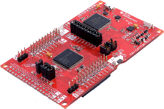
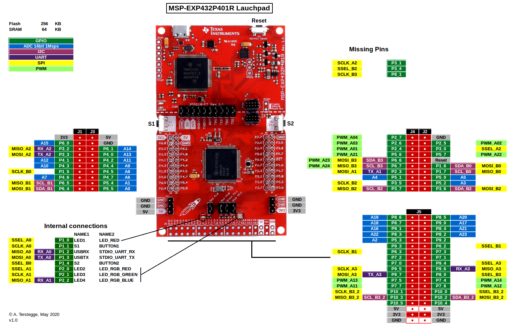

# MSP-EXP432P401R Launchpad support for Mbed OS 6



This project demonstrates how to use the
[MSP-EXP432P401R Launchpad](https://www.ti.com/tool/MSP-EXP432P401R)
with Mbed OS 6. It uses the custom board support based on Mbed OS to
compile and run a simple Blinky application, which will output some text
via the backchannel UART and blink the LEDs (RED/RGB) on the MSP432 Launchpad.
The default toolchain for this board is GNU ARM since this is the only free
toolchain available. The ARM and IAR C compilers are also supported, but
checked less frequently. The latest version of [Mbed Studio](https://os.mbed.com/studio/)
(0.9.1) using the ARM Compiler 6 should work without problems. Follow the
steps described below to compile and run the Blinky program!

### Mbed OS support


| Mbed Version  | hash       | Status               |
|---------------|------------|----------------------|
| mbed-os-6.0.0 | #165be7939 | Compiles and runs ok |


### Feature support

The following functional items (see `custom_targets.json`) are implemented:

* ANALOGIN
* I2C
* I2C_ASYNCH
* I2CSLAVE
* INTERRUPTIN
* PORTIN
* PORTINOUT
* PORTOUT
* PWMOUT
* SERIAL
* SPI
* SPI_ASYNCH
* SPISLAVE
* STDIO_MESSAGES
* USTICKER

This port to Mbed OS also includes configuration items for
the clock system and the ADC. The GPIO interface supports
the GPIO modes `OpenDrain`, `OpenDrainPullUp`, `OpenSource` and
`OpenSourcePullDown` using a software emulation (these modes are
not supported on hardware level). It is also possible to
assign both, rising and falling interrupt edges to a single
GPIO pin at the same time. This is also done with software
emulation. SPI, I2C and UART all support the interrupt-driven
ASYNC modes.

The software was written without the usage of some intermediate
libraries like TIs MSP432Ware or the MSP432 SDK, so the memory
footprint is quite small. The source code is very compact and
readable.

### Board pinout



### Import Project

```
mbed import https://github.com/Terstegge/mbed-os-MSP432.git
cd mbed-os-MSP432
```

### Compile Project

When using Mbed CLI, you might have to set the path to the
GNU ARM compiler first:
```
mbed config GCC_ARM_PATH <path to ARM GCC binary folder>
```
e.g.
```
mbed config GCC_ARM_PATH /usr/local/gcc-arm-none-eabi-9-2019-q4-major/bin
```

Now compile the project by typing
```
mbed compile
```
The default `TOOLCHAIN` (`GCC_ARM`) and `TARGET` (`MSP432_LAUNCHPAD`)
configurations are already set int the `.mbed` configuration file!
The end of the compile output should look like this:
```
...
Link: mbed-os-msp432
Elf2Bin: mbed-os-msp432
| Module                           |         .text |     .data |      .bss |
|----------------------------------|---------------|-----------|-----------|
| TARGET_MSP432/PeripheralPins.o   |         0(+0) |     0(+0) |     0(+0) |
| TARGET_MSP432/TARGET_MSP432P401R |   1194(+1194) |     8(+8) |     8(+8) |
| TARGET_MSP432/gpio_api.o         |     298(+298) |     0(+0) |     0(+0) |
| TARGET_MSP432/gpio_irq_api.o     |     256(+256) |     0(+0) | 244(+244) |
| TARGET_MSP432/gpio_msp432.o      |         0(+0) |   80(+80) |     0(+0) |
| TARGET_MSP432/i2c_api.o          |     220(+220) |     0(+0) |   16(+16) |
| TARGET_MSP432/pinmap.o           |     408(+408) |     0(+0) |   40(+40) |
| TARGET_MSP432/port_api.o         |       84(+84) |     0(+0) |     0(+0) |
| TARGET_MSP432/serial_api.o       |     348(+348) |     0(+0) |   32(+32) |
| TARGET_MSP432/spi_api.o          |     224(+224) |     0(+0) |   32(+32) |
| TARGET_MSP432/us_ticker_api.o    |     252(+252) |     0(+0) |     0(+0) |
| [fill]                           |       34(+34) |     0(+0) |   14(+14) |
| [lib]/c_nano.a                   |   2842(+2842) | 100(+100) |   21(+21) |
| [lib]/gcc.a                      |     760(+760) |     0(+0) |     0(+0) |
| [lib]/misc                       |     180(+180) |     4(+4) |   28(+28) |
| main.o                           |       92(+92) |     0(+0) |     0(+0) |
| mbed-os/drivers                  |     188(+188) |     0(+0) |     0(+0) |
| mbed-os/hal                      |   1596(+1596) |     4(+4) |   67(+67) |
| mbed-os/platform                 |   4776(+4776) | 260(+260) | 422(+422) |
| mbed-os/rtos                     |         4(+4) |     0(+0) |     0(+0) |
| Subtotals                        | 13756(+13756) | 456(+456) | 924(+924) |
Total Static RAM memory (data + bss): 1380(+1380) bytes
Total Flash memory (text + data): 14212(+14212) bytes

Image: ./BUILD/MSP432_LAUNCHPAD/GCC_ARM/mbed-os-msp432.bin
```
### Download and run the program, part 1: The TI way

This repository contains the
[TICloudAgent](https://processors.wiki.ti.com/index.php/TI_Cloud_Agent),
a small application that facilitates flashing and debugging hardware
devices from Texas Instruments. The `bin` folder contains a small
script which will call the TICloundAgent with the correct parameters.
The (only one) command line argument is the `*.elf` executable
(**not** the `*.bin` file!). So the executable can be downloaded and run by
typing:
```
bin/upload BUILD/MSP432_LAUNCHPAD/GCC_ARM/mbed-os-msp432.elf
```
```
DSLite version 10.1.0.1986
Configuring Debugger (may take a few minutes on first launch)...
	Initializing Register Database...
	Initializing: CS_DAP_0
	Executing Startup Scripts: CS_DAP_0
	Initializing: CORTEX_M4_0
	Executing Startup Scripts: CORTEX_M4_0
Connecting...
GEL: CORTEX_M4_0: GEL Output: Memory Map Initialization Complete
GEL: CORTEX_M4_0: GEL Output: Halting Watchdog Timer
GEL: CORTEX_M4_0: WARNING   : On MSP432P401R hitting a breakpoint cannot be detected by the debugger when the device is in low power mode.
                         Click the pause button during debug to check if the device is held at the breakpoint.
Loading Program: BUILD/MSP432_LAUNCHPAD/GCC_ARM/mbed-os-msp432.elf
	Preparing ... 
	.text: 0 of 15144 at 0x0
	.data: 0 of 424 at 0x3b28: 97%
	Finished: 97%
	Setting PC to entry point.: 97%
Running...
Success
```
The LEDs should blink now, and the serial output via the backchannel UART
should be visible. 

### Download and run the program, part 2: The Mbed way

This Launchpad includes an embedded XDS110 debugging probe. The firmware for
this probe can operate in different modes. To show and configure these modes
first change the working directory:
```
cd TICloudAgent/loaders/ccs_base/common/uscif/xds110
``` 
Connect your Launchpad via USB, and enumerate the connected devices. The
Launchpad should show up:
```
./xdsdfu -e

USB Device Firmware Upgrade Utility
Copyright (c) 2008-2019 Texas Instruments Incorporated.  All rights reserved.

Scanning USB buses for supported XDS110 devices...

<<<< Device 0 >>>>

VID: 0x0451    PID: 0xbef3
Device Name:   XDS110 Embed with CMSIS-DAP
Version:       3.0.0.12
Manufacturer:  Texas Instruments
Serial Num:    M4321005
Mode:          Runtime
Configuration: Standard

Found 1 device.
```
Now switch to the programming (DFU) mode and flash the latest debugger firmware:
```
./xdsdfu -m

USB Device Firmware Upgrade Utility
Copyright (c) 2008-2019 Texas Instruments Incorporated.  All rights reserved.
...
Switching device into DFU mode.
```
```
./xdsdfu -f firmware_3.0.0.12.bin 

USB Device Firmware Upgrade Utility
Copyright (c) 2008-2019 Texas Instruments Incorporated.  All rights reserved.

Scanning USB buses for supported XDS110 devices...

Downloading firmware_3.0.0.12.bin to device...
```
Now we have a look at the available modes:
```
./xdsdfu -c ?

USB Device Firmware Upgrade Utility
Copyright (c) 2008-2019 Texas Instruments Incorporated.  All rights reserved.

Device configurations (use the configuration number with the -c option).

Note that in firmware versions before 2.3.0.15, setting a configuration 
will have no effect; only the standard configuration will be used.

Also note that if you select a configuration that is not supported by 
the hardware, the standard configuration will be used instead.

1 -- Standard configuration: Features include XDS Debug, App COM Port,
     Aux COM Port, CMSIS-DAP 1.0, and EnergyTrace support.

2 -- Drag-n-Drop configuration: Features include XDS Debug, App COM Port,
     Aux COM Port, CMSIS-DAP 1.0, and Drag-n-Drop Flash.

The following configuration was first implemented in version 3.0.0.8

4 -- CMSIS-DAP 2.0 configuration: Features include XDS Debug, App COM Port,
     Aux COM Port, CMSIS-DAP 2.0, EnergyTrace support, and Drag-n-Drop Flash
     (Drag-n-Drop Flash is only enabled on embedded XDS110 probes.)

Beginning with version 3.0.0.5, Drag-n-Drop Flash supports the following
     targets: MSP432, CC3220SF, CC13x0, CC26x0, CC13x2, and CC26x2.
```
For Mbed OS we need a mode with Drag-n-Drop Flash. Both, mode 2 and mode 4
will work. Mode 2 has the advantage that you can continue to use the board
with TI tools like Code Composer Studio. Here we choose mode 4 with all
its nice features:
```
./xdsdfu -c 4

USB Device Firmware Upgrade Utility
Copyright (c) 2008-2019 Texas Instruments Incorporated.  All rights reserved.

Scanning USB buses for supported XDS110 devices...

Setting configuration to number 4 (CMSIS-DAP 2.0)...
```
If you need to switch back to the original state, simply follow the
instructions above and select mode 1, which is the factory default.

The Launchpad has a 8-character serial number (e.g. M4321005, see above).
The first 4 characters will be the Mbed target ID, but Mbed OS will only
accept hexadecimal characters. So we re-program the serial number and reset
the board. We change the leading 'M' to '0' and leave the remaining 7
characters as they are:
```
./xdsdfu -s 04321005 -r

USB Device Firmware Upgrade Utility
Copyright (c) 2008-2019 Texas Instruments Incorporated.  All rights reserved.

Scanning USB buses for supported XDS110 devices...

Setting serial number to "04321005"...
```
Now the board should show up as a mass storage device. One my computer
(Linux Mint 64 bit) the board is mounted under `/media/andreas/XDS110`.
We will refer to this folder as the `<mount_dir>`. Go back to the root
folder of the project and let Mbed OS detect the board:
```
cd ../../../../../..
mbedls
WARNING:mbedls.lstools_base:daplink entry: "0432" not found in platform database
| platform_name    | platform_name_unique | mount_point           | serial_port  | target_id | daplink_version |
|------------------|----------------------|-----------------------|--------------|-----------|-----------------|
| MSP432_LAUNCHPAD | MSP432_LAUNCHPAD[0]  | /media/andreas/XDS110 | /dev/ttyACM0 | 04321005  | 0203            |
```
The board information is taken from the file `mbedls.json`:
```
{
    "04321005": {
        "daplink_build": "Jun 13 2014 09:55:22", 
        "daplink_url": "http://mbed.org/device/?code=04321005", 
        "daplink_version": "0203", 
        "device_type": "daplink", 
        "directory_entries": [
            "ReadMe.txt", 
            "Status-Done.txt"
        ], 
        "mount_point": "/media/andreas/XDS110", 
        "platform_name": "MSP432_LAUNCHPAD", 
        "platform_name_unique": "MSP432_LAUNCHPAD[0]", 
        "product_id": "02a5", 
        "serial_port": "/dev/ttyACM0", 
        "vendor_id": "1cbe"
    }
}
```
Change this file so that the `mount_point` points to your `<mount_dir>`, and
the `serial_port` points to your backchannel UART device. The other entries
can be left untouched. `mbedls` will complain about the target ID `0432`,
which is (of course) no official target ID. So we create a mock for this new ID:
```
mbedls -m 0432:MSP432_LAUNCHPAD
mbedls
| platform_name    | platform_name_unique | mount_point           | serial_port  | target_id | daplink_version |
|------------------|----------------------|-----------------------|--------------|-----------|-----------------|
| MSP432_LAUNCHPAD | MSP432_LAUNCHPAD[0]  | /media/andreas/XDS110 | /dev/ttyACM0 | 04321005  | 0203            |
```
Finally the board shows up as a Mbed-enabled device :) The command `mbed
detect` will still fail (no supported platforms). It has to be investigated
how this command retrieves the necessary information.

Download the Blinky program via Drag-n-Drop:
```
cp BUILD/MSP432_LAUNCHPAD/GCC_ARM/mbed-os-msp432.bin <mount_dir>
```
The LEDs should blink and the output via the backchannel UART should be
visible. After downloading the program, the mass storage device will
leave for a short while, but the USB device itself will stay connected all
the time (this might be a difference compared to a 'real' daplink probe).
This leads to the problem that my file manager does not mount the
mass storage device after a download. For Linux users I provide a small
shell script (`bin/mountXDS110`), which will check (in a endless loop) if
the mass storage device (for me `/dev/sda`) is present but the `<mount_dir>`
is not visible. In this case the script will automatically perform a
mount operation. The script can be run in user mode. Simply change this
script to your needs, and let it run in a separate terminal.

Another problem for me (on Linux) was the `modemmanager`, which connected
to the UART device and prohibited access to it. This problem showed
up during greentea test. You might consider deleting this program with
`sudo apt-get purge modemmanager`. 

### Build configuration

The project contains the file `mbed_app.json`, which can be used to
configure Mbed OS and the board configuration.
```
{
    "requires": ["bare-metal"],
    "target_overrides": {
        "*": {
            "target.c_lib"        : "small",
            "target.dco_rsel"     : "DCO_3MHz",
            "target.dco_tune"     :  0,
            "target.mclk_select"  : "HFXT",
            "target.mclk_div"     : "DIV1",
            "target.smclk_select" : "HFXT",
            "target.smclk_div"    : "DIV2",
            "target.adc_auto_scan": 1
        }
    }
}
```
As default, the
[bare-metal](https://os.mbed.com/docs/mbed-os/v5.15/reference/mbed-os-bare-metal.html)
profile is selected, which does not contain the RTOS parts.
Simply delete this line if you wish to have the full Mbed OS
functionality. The master CPU clock (MCLK) is configured to use the
48MHz crystal, the subsystem master clock (SMCLK) is also using the
48MHz crystal but with a divider of 2. The default clock configuration
(see file `custom_targets.json`) is the DCO with 3MHz for both, MCLK
and SMCLK. More information on all compile-time configuration parameters
can be shown with
```
mbed compile --config -v
```

### Serial output

When connected to a Linux PC, the MSP432 Launchpad will show up as
two virtual serial ports: `/dev/ttyACM0` and `/dev/ttyACM1`.
The first one is connected to the backchannel UART, the second one
serves as the debug interface.
To see the serial output just connect a serial terminal program
(e.g. `gtkterm`) of your choice to `/dev/ttyACM0` using the UART
protocol 8N1 and baudrate 9600.

### Mbed OS updates

The project has a fixed link to the latest Mbed OS version, which is
known to work with this board (see file `mbed-os.lib`). If you wish
to upgrade to the latest version, just use git in the subfolder
`mbed-os`, or simply type
```
cd mbed-os
mbed update <mbed-os hash / tag >
```

### Testing

This Mbed OS port for the MSP432P401R can run the standard greentea-tests
for Mbed OS! To do this, first edit the file `mbed_app.json`
to use the full Mbed OS functionality and the standard runtime C library.
The file should look like this:
```
{
    "target_overrides": {
        "*": {
            "target.mclk_select"  : "HFXT",
            "target.mclk_div"     : "DIV1",
            "target.smclk_select" : "HFXT",
            "target.smclk_div"    : "DIV2",
        }
    }
}

```
Then run
```
mbed test --compile
```
to compile all available tests for this board. To run the tests,
prepare the launchpad to look like a Mbed-enabled device as 
described above. Do not forget to run the `mountXDS110` script
in a separate terminal, if you face the same mount problems as I did.

Now we can run all the tests:
```
mbed test --run | tee test.log
```
The final output should show no errors (86 test suites with 565 test
cases):
```
mbedgt: test suite report:
| target                   | platform_name    | test suite                                                                           | result | elapsed_time (sec) | copy_method |
|--------------------------|------------------|--------------------------------------------------------------------------------------|--------|--------------------|-------------|
| MSP432_LAUNCHPAD-GCC_ARM | MSP432_LAUNCHPAD | mbed-os-features-frameworks-utest-tests-unit_tests-basic_test                        | OK     | 11.88              | default     |
| MSP432_LAUNCHPAD-GCC_ARM | MSP432_LAUNCHPAD | mbed-os-features-frameworks-utest-tests-unit_tests-basic_test_default                | OK     | 11.91              | default     |
| MSP432_LAUNCHPAD-GCC_ARM | MSP432_LAUNCHPAD | mbed-os-features-frameworks-utest-tests-unit_tests-case_async_validate               | OK     | 13.59              | default     |
| MSP432_LAUNCHPAD-GCC_ARM | MSP432_LAUNCHPAD | mbed-os-features-frameworks-utest-tests-unit_tests-case_control_async                | OK     | 20.05              | default     |
| MSP432_LAUNCHPAD-GCC_ARM | MSP432_LAUNCHPAD | mbed-os-features-frameworks-utest-tests-unit_tests-case_control_repeat               | OK     | 13.87              | default     |
| MSP432_LAUNCHPAD-GCC_ARM | MSP432_LAUNCHPAD | mbed-os-features-frameworks-utest-tests-unit_tests-case_selection                    | OK     | 11.79              | default     |
| MSP432_LAUNCHPAD-GCC_ARM | MSP432_LAUNCHPAD | mbed-os-features-frameworks-utest-tests-unit_tests-case_setup_failure                | OK     | 12.33              | default     |
| MSP432_LAUNCHPAD-GCC_ARM | MSP432_LAUNCHPAD | mbed-os-features-frameworks-utest-tests-unit_tests-case_teardown_failure             | OK     | 12.63              | default     |
| MSP432_LAUNCHPAD-GCC_ARM | MSP432_LAUNCHPAD | mbed-os-features-frameworks-utest-tests-unit_tests-control_type                      | OK     | 12.4               | default     |
| MSP432_LAUNCHPAD-GCC_ARM | MSP432_LAUNCHPAD | mbed-os-features-frameworks-utest-tests-unit_tests-minimal_async_scheduler           | OK     | 12.64              | default     |
| MSP432_LAUNCHPAD-GCC_ARM | MSP432_LAUNCHPAD | mbed-os-features-frameworks-utest-tests-unit_tests-minimal_scheduler                 | OK     | 13.38              | default     |
| MSP432_LAUNCHPAD-GCC_ARM | MSP432_LAUNCHPAD | mbed-os-features-frameworks-utest-tests-unit_tests-test_assertion_failure_test_setup | OK     | 11.55              | default     |
| MSP432_LAUNCHPAD-GCC_ARM | MSP432_LAUNCHPAD | mbed-os-features-frameworks-utest-tests-unit_tests-test_setup_case_selection_failure | OK     | 11.74              | default     |
| MSP432_LAUNCHPAD-GCC_ARM | MSP432_LAUNCHPAD | mbed-os-features-frameworks-utest-tests-unit_tests-test_setup_failure                | OK     | 12.03              | default     |
| MSP432_LAUNCHPAD-GCC_ARM | MSP432_LAUNCHPAD | mbed-os-features-frameworks-utest-tests-unit_tests-test_skip                         | OK     | 11.93              | default     |
| MSP432_LAUNCHPAD-GCC_ARM | MSP432_LAUNCHPAD | mbed-os-features-storage-tests-blockdevice-buffered_block_device                     | OK     | 11.84              | default     |
| MSP432_LAUNCHPAD-GCC_ARM | MSP432_LAUNCHPAD | mbed-os-features-storage-tests-blockdevice-flashsim_block_device                     | OK     | 11.87              | default     |
| MSP432_LAUNCHPAD-GCC_ARM | MSP432_LAUNCHPAD | mbed-os-features-storage-tests-blockdevice-general_block_device                      | OK     | 11.23              | default     |
| MSP432_LAUNCHPAD-GCC_ARM | MSP432_LAUNCHPAD | mbed-os-features-storage-tests-blockdevice-heap_block_device                         | OK     | 13.55              | default     |
| MSP432_LAUNCHPAD-GCC_ARM | MSP432_LAUNCHPAD | mbed-os-features-storage-tests-blockdevice-mbr_block_device                          | OK     | 12.92              | default     |
| MSP432_LAUNCHPAD-GCC_ARM | MSP432_LAUNCHPAD | mbed-os-features-storage-tests-blockdevice-util_block_device                         | OK     | 12.2               | default     |
| MSP432_LAUNCHPAD-GCC_ARM | MSP432_LAUNCHPAD | mbed-os-features-storage-tests-kvstore-static_tests                                  | OK     | 25.18              | default     |
| MSP432_LAUNCHPAD-GCC_ARM | MSP432_LAUNCHPAD | mbed-os-features-storage-tests-kvstore-tdbstore_whitebox                             | OK     | 14.81              | default     |
| MSP432_LAUNCHPAD-GCC_ARM | MSP432_LAUNCHPAD | mbed-os-tests-events-queue                                                           | OK     | 20.38              | default     |
| MSP432_LAUNCHPAD-GCC_ARM | MSP432_LAUNCHPAD | mbed-os-tests-events-timing                                                          | OK     | 72.32              | default     |
| MSP432_LAUNCHPAD-GCC_ARM | MSP432_LAUNCHPAD | mbed-os-tests-mbed_drivers-buffered_serial                                           | OK     | 11.99              | default     |
| MSP432_LAUNCHPAD-GCC_ARM | MSP432_LAUNCHPAD | mbed-os-tests-mbed_drivers-c_strings                                                 | OK     | 12.99              | default     |
| MSP432_LAUNCHPAD-GCC_ARM | MSP432_LAUNCHPAD | mbed-os-tests-mbed_drivers-crc                                                       | OK     | 12.83              | default     |
| MSP432_LAUNCHPAD-GCC_ARM | MSP432_LAUNCHPAD | mbed-os-tests-mbed_drivers-dev_null                                                  | OK     | 13.56              | default     |
| MSP432_LAUNCHPAD-GCC_ARM | MSP432_LAUNCHPAD | mbed-os-tests-mbed_drivers-echo                                                      | OK     | 13.37              | default     |
| MSP432_LAUNCHPAD-GCC_ARM | MSP432_LAUNCHPAD | mbed-os-tests-mbed_drivers-generic_tests                                             | OK     | 12.17              | default     |
| MSP432_LAUNCHPAD-GCC_ARM | MSP432_LAUNCHPAD | mbed-os-tests-mbed_drivers-race_test                                                 | OK     | 12.83              | default     |
| MSP432_LAUNCHPAD-GCC_ARM | MSP432_LAUNCHPAD | mbed-os-tests-mbed_drivers-stl_features                                              | OK     | 12.26              | default     |
| MSP432_LAUNCHPAD-GCC_ARM | MSP432_LAUNCHPAD | mbed-os-tests-mbed_drivers-ticker                                                    | OK     | 41.57              | default     |
| MSP432_LAUNCHPAD-GCC_ARM | MSP432_LAUNCHPAD | mbed-os-tests-mbed_drivers-timeout                                                   | OK     | 29.24              | default     |
| MSP432_LAUNCHPAD-GCC_ARM | MSP432_LAUNCHPAD | mbed-os-tests-mbed_drivers-timer                                                     | OK     | 18.58              | default     |
| MSP432_LAUNCHPAD-GCC_ARM | MSP432_LAUNCHPAD | mbed-os-tests-mbed_drivers-timerevent                                                | OK     | 13.56              | default     |
| MSP432_LAUNCHPAD-GCC_ARM | MSP432_LAUNCHPAD | mbed-os-tests-mbed_drivers-unbuffered_serial                                         | OK     | 11.99              | default     |
| MSP432_LAUNCHPAD-GCC_ARM | MSP432_LAUNCHPAD | mbed-os-tests-mbed_functional-callback                                               | OK     | 13.31              | default     |
| MSP432_LAUNCHPAD-GCC_ARM | MSP432_LAUNCHPAD | mbed-os-tests-mbed_functional-callback_big                                           | OK     | 13.14              | default     |
| MSP432_LAUNCHPAD-GCC_ARM | MSP432_LAUNCHPAD | mbed-os-tests-mbed_functional-callback_small                                         | OK     | 13.09              | default     |
| MSP432_LAUNCHPAD-GCC_ARM | MSP432_LAUNCHPAD | mbed-os-tests-mbed_hal-common_tickers                                                | OK     | 14.19              | default     |
| MSP432_LAUNCHPAD-GCC_ARM | MSP432_LAUNCHPAD | mbed-os-tests-mbed_hal-common_tickers_freq                                           | OK     | 20.94              | default     |
| MSP432_LAUNCHPAD-GCC_ARM | MSP432_LAUNCHPAD | mbed-os-tests-mbed_hal-critical_section                                              | OK     | 11.91              | default     |
| MSP432_LAUNCHPAD-GCC_ARM | MSP432_LAUNCHPAD | mbed-os-tests-mbed_hal-gpio                                                          | OK     | 11.49              | default     |
| MSP432_LAUNCHPAD-GCC_ARM | MSP432_LAUNCHPAD | mbed-os-tests-mbed_hal-minimum_requirements                                          | OK     | 11.75              | default     |
| MSP432_LAUNCHPAD-GCC_ARM | MSP432_LAUNCHPAD | mbed-os-tests-mbed_hal-pinmap                                                        | OK     | 12.14              | default     |
| MSP432_LAUNCHPAD-GCC_ARM | MSP432_LAUNCHPAD | mbed-os-tests-mbed_hal-rtc_time                                                      | OK     | 13.57              | default     |
| MSP432_LAUNCHPAD-GCC_ARM | MSP432_LAUNCHPAD | mbed-os-tests-mbed_hal-rtc_time_conv                                                 | OK     | 30.0               | default     |
| MSP432_LAUNCHPAD-GCC_ARM | MSP432_LAUNCHPAD | mbed-os-tests-mbed_hal-stack_size_unification                                        | OK     | 11.56              | default     |
| MSP432_LAUNCHPAD-GCC_ARM | MSP432_LAUNCHPAD | mbed-os-tests-mbed_hal-ticker                                                        | OK     | 24.94              | default     |
| MSP432_LAUNCHPAD-GCC_ARM | MSP432_LAUNCHPAD | mbed-os-tests-mbed_hal-us_ticker                                                     | OK     | 11.52              | default     |
| MSP432_LAUNCHPAD-GCC_ARM | MSP432_LAUNCHPAD | mbed-os-tests-mbed_platform-atomic                                                   | OK     | 23.2               | default     |
| MSP432_LAUNCHPAD-GCC_ARM | MSP432_LAUNCHPAD | mbed-os-tests-mbed_platform-circularbuffer                                           | OK     | 17.94              | default     |
| MSP432_LAUNCHPAD-GCC_ARM | MSP432_LAUNCHPAD | mbed-os-tests-mbed_platform-critical_section                                         | OK     | 13.85              | default     |
| MSP432_LAUNCHPAD-GCC_ARM | MSP432_LAUNCHPAD | mbed-os-tests-mbed_platform-error_handling                                           | OK     | 12.29              | default     |
| MSP432_LAUNCHPAD-GCC_ARM | MSP432_LAUNCHPAD | mbed-os-tests-mbed_platform-filehandle                                               | OK     | 13.01              | default     |
| MSP432_LAUNCHPAD-GCC_ARM | MSP432_LAUNCHPAD | mbed-os-tests-mbed_platform-minimal-printf                                           | OK     | 16.99              | default     |
| MSP432_LAUNCHPAD-GCC_ARM | MSP432_LAUNCHPAD | mbed-os-tests-mbed_platform-sharedptr                                                | OK     | 12.27              | default     |
| MSP432_LAUNCHPAD-GCC_ARM | MSP432_LAUNCHPAD | mbed-os-tests-mbed_platform-singletonptr                                             | OK     | 11.73              | default     |
| MSP432_LAUNCHPAD-GCC_ARM | MSP432_LAUNCHPAD | mbed-os-tests-mbed_platform-stream                                                   | OK     | 12.6               | default     |
| MSP432_LAUNCHPAD-GCC_ARM | MSP432_LAUNCHPAD | mbed-os-tests-mbed_platform-system_reset                                             | OK     | 12.32              | default     |
| MSP432_LAUNCHPAD-GCC_ARM | MSP432_LAUNCHPAD | mbed-os-tests-mbed_platform-transaction                                              | OK     | 12.8               | default     |
| MSP432_LAUNCHPAD-GCC_ARM | MSP432_LAUNCHPAD | mbed-os-tests-mbed_platform-wait_ns                                                  | OK     | 12.63              | default     |
| MSP432_LAUNCHPAD-GCC_ARM | MSP432_LAUNCHPAD | mbed-os-tests-mbedmicro-mbed-attributes                                              | OK     | 13.93              | default     |
| MSP432_LAUNCHPAD-GCC_ARM | MSP432_LAUNCHPAD | mbed-os-tests-mbedmicro-mbed-call_before_main                                        | OK     | 11.62              | default     |
| MSP432_LAUNCHPAD-GCC_ARM | MSP432_LAUNCHPAD | mbed-os-tests-mbedmicro-mbed-cpp                                                     | OK     | 11.9               | default     |
| MSP432_LAUNCHPAD-GCC_ARM | MSP432_LAUNCHPAD | mbed-os-tests-mbedmicro-mbed-div                                                     | OK     | 11.64              | default     |
| MSP432_LAUNCHPAD-GCC_ARM | MSP432_LAUNCHPAD | mbed-os-tests-mbedmicro-mbed-static_assert                                           | OK     | 11.48              | default     |
| MSP432_LAUNCHPAD-GCC_ARM | MSP432_LAUNCHPAD | mbed-os-tests-mbedmicro-rtos-mbed-basic                                              | OK     | 21.0               | default     |
| MSP432_LAUNCHPAD-GCC_ARM | MSP432_LAUNCHPAD | mbed-os-tests-mbedmicro-rtos-mbed-condition_variable                                 | OK     | 11.97              | default     |
| MSP432_LAUNCHPAD-GCC_ARM | MSP432_LAUNCHPAD | mbed-os-tests-mbedmicro-rtos-mbed-event_flags                                        | OK     | 15.37              | default     |
| MSP432_LAUNCHPAD-GCC_ARM | MSP432_LAUNCHPAD | mbed-os-tests-mbedmicro-rtos-mbed-heap_and_stack                                     | OK     | 12.7               | default     |
| MSP432_LAUNCHPAD-GCC_ARM | MSP432_LAUNCHPAD | mbed-os-tests-mbedmicro-rtos-mbed-kernel_tick_count                                  | OK     | 14.23              | default     |
| MSP432_LAUNCHPAD-GCC_ARM | MSP432_LAUNCHPAD | mbed-os-tests-mbedmicro-rtos-mbed-mail                                               | OK     | 16.27              | default     |
| MSP432_LAUNCHPAD-GCC_ARM | MSP432_LAUNCHPAD | mbed-os-tests-mbedmicro-rtos-mbed-malloc                                             | OK     | 33.48              | default     |
| MSP432_LAUNCHPAD-GCC_ARM | MSP432_LAUNCHPAD | mbed-os-tests-mbedmicro-rtos-mbed-memorypool                                         | OK     | 19.63              | default     |
| MSP432_LAUNCHPAD-GCC_ARM | MSP432_LAUNCHPAD | mbed-os-tests-mbedmicro-rtos-mbed-mutex                                              | OK     | 16.21              | default     |
| MSP432_LAUNCHPAD-GCC_ARM | MSP432_LAUNCHPAD | mbed-os-tests-mbedmicro-rtos-mbed-queue                                              | OK     | 14.83              | default     |
| MSP432_LAUNCHPAD-GCC_ARM | MSP432_LAUNCHPAD | mbed-os-tests-mbedmicro-rtos-mbed-semaphore                                          | OK     | 17.46              | default     |
| MSP432_LAUNCHPAD-GCC_ARM | MSP432_LAUNCHPAD | mbed-os-tests-mbedmicro-rtos-mbed-signals                                            | OK     | 23.93              | default     |
| MSP432_LAUNCHPAD-GCC_ARM | MSP432_LAUNCHPAD | mbed-os-tests-mbedmicro-rtos-mbed-systimer                                           | OK     | 13.08              | default     |
| MSP432_LAUNCHPAD-GCC_ARM | MSP432_LAUNCHPAD | mbed-os-tests-mbedmicro-rtos-mbed-threads                                            | OK     | 23.32              | default     |
| MSP432_LAUNCHPAD-GCC_ARM | MSP432_LAUNCHPAD | mbed-os-tests-mbedtls-multi                                                          | OK     | 12.8               | default     |
| MSP432_LAUNCHPAD-GCC_ARM | MSP432_LAUNCHPAD | mbed-os-tests-mbedtls-selftest                                                       | OK     | 18.93              | default     |
| MSP432_LAUNCHPAD-GCC_ARM | MSP432_LAUNCHPAD | mbed-os-tests-network-l3ip                                                           | OK     | 11.73              | default     |
mbedgt: test suite results: 86 OK
mbedgt: test case report:
| target                   | platform_name    | test suite                                                                           | test case                                                                                                              | passed | failed | result | elapsed_time (sec) |
|--------------------------|------------------|--------------------------------------------------------------------------------------|------------------------------------------------------------------------------------------------------------------------|--------|--------|--------|--------------------|
| MSP432_LAUNCHPAD-GCC_ARM | MSP432_LAUNCHPAD | mbed-os-features-frameworks-utest-tests-unit_tests-basic_test                        | Repeating Test                                                                                                         | 2      | 0      | OK     | 0.07               |
| MSP432_LAUNCHPAD-GCC_ARM | MSP432_LAUNCHPAD | mbed-os-features-frameworks-utest-tests-unit_tests-basic_test                        | Simple Test                                                                                                            | 1      | 0      | OK     | 0.05               |
| MSP432_LAUNCHPAD-GCC_ARM | MSP432_LAUNCHPAD | mbed-os-features-frameworks-utest-tests-unit_tests-basic_test_default                | Repeating Test                                                                                                         | 2      | 0      | OK     | 0.08               |
| MSP432_LAUNCHPAD-GCC_ARM | MSP432_LAUNCHPAD | mbed-os-features-frameworks-utest-tests-unit_tests-basic_test_default                | Simple Test                                                                                                            | 1      | 0      | OK     | 0.04               |
| MSP432_LAUNCHPAD-GCC_ARM | MSP432_LAUNCHPAD | mbed-os-features-frameworks-utest-tests-unit_tests-case_async_validate               | Validate: Attributed Validation: Cancel Repeat                                                                         | 1      | 0      | OK     | 0.17               |
| MSP432_LAUNCHPAD-GCC_ARM | MSP432_LAUNCHPAD | mbed-os-features-frameworks-utest-tests-unit_tests-case_async_validate               | Validate: Attributed Validation: Enable Repeat Handler                                                                 | 2      | 0      | OK     | 0.19               |
| MSP432_LAUNCHPAD-GCC_ARM | MSP432_LAUNCHPAD | mbed-os-features-frameworks-utest-tests-unit_tests-case_async_validate               | Validate: Multiple Premature Validation                                                                                | 1      | 0      | OK     | 0.07               |
| MSP432_LAUNCHPAD-GCC_ARM | MSP432_LAUNCHPAD | mbed-os-features-frameworks-utest-tests-unit_tests-case_async_validate               | Validate: Multiple Validation                                                                                          | 1      | 0      | OK     | 0.17               |
| MSP432_LAUNCHPAD-GCC_ARM | MSP432_LAUNCHPAD | mbed-os-features-frameworks-utest-tests-unit_tests-case_async_validate               | Validate: Premature Validation                                                                                         | 1      | 0      | OK     | 0.07               |
| MSP432_LAUNCHPAD-GCC_ARM | MSP432_LAUNCHPAD | mbed-os-features-frameworks-utest-tests-unit_tests-case_async_validate               | Validate: Simple Validation                                                                                            | 1      | 0      | OK     | 0.07               |
| MSP432_LAUNCHPAD-GCC_ARM | MSP432_LAUNCHPAD | mbed-os-features-frameworks-utest-tests-unit_tests-case_control_async                | Control: Await                                                                                                         | 1      | 0      | OK     | 1.41               |
| MSP432_LAUNCHPAD-GCC_ARM | MSP432_LAUNCHPAD | mbed-os-features-frameworks-utest-tests-unit_tests-case_control_async                | Control: CaseNext                                                                                                      | 1      | 0      | OK     | 0.05               |
| MSP432_LAUNCHPAD-GCC_ARM | MSP432_LAUNCHPAD | mbed-os-features-frameworks-utest-tests-unit_tests-case_control_async                | Control: NoTimeout                                                                                                     | 1      | 0      | OK     | 0.05               |
| MSP432_LAUNCHPAD-GCC_ARM | MSP432_LAUNCHPAD | mbed-os-features-frameworks-utest-tests-unit_tests-case_control_async                | Control: RepeatAllOnTimeout                                                                                            | 1      | 0      | OK     | 0.1                |
| MSP432_LAUNCHPAD-GCC_ARM | MSP432_LAUNCHPAD | mbed-os-features-frameworks-utest-tests-unit_tests-case_control_async                | Control: RepeatHandlerOnTimeout                                                                                        | 1      | 0      | OK     | 1.63               |
| MSP432_LAUNCHPAD-GCC_ARM | MSP432_LAUNCHPAD | mbed-os-features-frameworks-utest-tests-unit_tests-case_control_async                | Control: Timeout (Failure)                                                                                             | 1      | 0      | OK     | 0.22               |
| MSP432_LAUNCHPAD-GCC_ARM | MSP432_LAUNCHPAD | mbed-os-features-frameworks-utest-tests-unit_tests-case_control_async                | Control: Timeout (Success)                                                                                             | 1      | 0      | OK     | 0.16               |
| MSP432_LAUNCHPAD-GCC_ARM | MSP432_LAUNCHPAD | mbed-os-features-frameworks-utest-tests-unit_tests-case_control_repeat               | Control: CaseNext                                                                                                      | 1      | 0      | OK     | 0.05               |
| MSP432_LAUNCHPAD-GCC_ARM | MSP432_LAUNCHPAD | mbed-os-features-frameworks-utest-tests-unit_tests-case_control_repeat               | Control: NoRepeat                                                                                                      | 1      | 0      | OK     | 0.04               |
| MSP432_LAUNCHPAD-GCC_ARM | MSP432_LAUNCHPAD | mbed-os-features-frameworks-utest-tests-unit_tests-case_control_repeat               | Control: RepeatAll                                                                                                     | 10     | 0      | OK     | 0.05               |
| MSP432_LAUNCHPAD-GCC_ARM | MSP432_LAUNCHPAD | mbed-os-features-frameworks-utest-tests-unit_tests-case_control_repeat               | Control: RepeatHandler                                                                                                 | 10     | 0      | OK     | 0.05               |
| MSP432_LAUNCHPAD-GCC_ARM | MSP432_LAUNCHPAD | mbed-os-features-frameworks-utest-tests-unit_tests-case_selection                    | Case 1                                                                                                                 | 1      | 0      | OK     | 0.03               |
| MSP432_LAUNCHPAD-GCC_ARM | MSP432_LAUNCHPAD | mbed-os-features-frameworks-utest-tests-unit_tests-case_selection                    | Case 2                                                                                                                 | 1      | 0      | OK     | 0.04               |
| MSP432_LAUNCHPAD-GCC_ARM | MSP432_LAUNCHPAD | mbed-os-features-frameworks-utest-tests-unit_tests-case_selection                    | Case 3                                                                                                                 | 1      | 0      | OK     | 0.03               |
| MSP432_LAUNCHPAD-GCC_ARM | MSP432_LAUNCHPAD | mbed-os-features-frameworks-utest-tests-unit_tests-case_setup_failure                | Setup handler returns ABORT                                                                                            | 1      | 0      | OK     | 0.12               |
| MSP432_LAUNCHPAD-GCC_ARM | MSP432_LAUNCHPAD | mbed-os-features-frameworks-utest-tests-unit_tests-case_setup_failure                | Setup handler returns CONTINUE                                                                                         | 1      | 0      | OK     | 0.06               |
| MSP432_LAUNCHPAD-GCC_ARM | MSP432_LAUNCHPAD | mbed-os-features-frameworks-utest-tests-unit_tests-case_setup_failure                | Setup handler returns IGNORE                                                                                           | 1      | 0      | OK     | 0.13               |
| MSP432_LAUNCHPAD-GCC_ARM | MSP432_LAUNCHPAD | mbed-os-features-frameworks-utest-tests-unit_tests-case_teardown_failure             | Teardown handler returns ABORT                                                                                         | 1      | 0      | OK     | 0.06               |
| MSP432_LAUNCHPAD-GCC_ARM | MSP432_LAUNCHPAD | mbed-os-features-frameworks-utest-tests-unit_tests-case_teardown_failure             | Teardown handler returns ABORT but is IGNORED                                                                          | 1      | 0      | OK     | 0.07               |
| MSP432_LAUNCHPAD-GCC_ARM | MSP432_LAUNCHPAD | mbed-os-features-frameworks-utest-tests-unit_tests-case_teardown_failure             | Teardown handler returns CONTINUE                                                                                      | 1      | 0      | OK     | 0.07               |
| MSP432_LAUNCHPAD-GCC_ARM | MSP432_LAUNCHPAD | mbed-os-features-frameworks-utest-tests-unit_tests-control_type                      | Testing combinations of different group                                                                                | 1      | 0      | OK     | 0.06               |
| MSP432_LAUNCHPAD-GCC_ARM | MSP432_LAUNCHPAD | mbed-os-features-frameworks-utest-tests-unit_tests-control_type                      | Testing combinations of same group                                                                                     | 1      | 0      | OK     | 0.06               |
| MSP432_LAUNCHPAD-GCC_ARM | MSP432_LAUNCHPAD | mbed-os-features-frameworks-utest-tests-unit_tests-control_type                      | Testing constants                                                                                                      | 1      | 0      | OK     | 0.05               |
| MSP432_LAUNCHPAD-GCC_ARM | MSP432_LAUNCHPAD | mbed-os-features-frameworks-utest-tests-unit_tests-control_type                      | Testing constructors                                                                                                   | 1      | 0      | OK     | 0.05               |
| MSP432_LAUNCHPAD-GCC_ARM | MSP432_LAUNCHPAD | mbed-os-features-frameworks-utest-tests-unit_tests-minimal_async_scheduler           | Minimal Scheduler: Async Case 4 (Failure)                                                                              | 0      | 0      | OK     | 0.34               |
| MSP432_LAUNCHPAD-GCC_ARM | MSP432_LAUNCHPAD | mbed-os-features-frameworks-utest-tests-unit_tests-minimal_async_scheduler           | Minimal Scheduler: Case 1                                                                                              | 1      | 0      | OK     | 0.05               |
| MSP432_LAUNCHPAD-GCC_ARM | MSP432_LAUNCHPAD | mbed-os-features-frameworks-utest-tests-unit_tests-minimal_async_scheduler           | Minimal Scheduler: Case 2                                                                                              | 1      | 0      | OK     | 0.07               |
| MSP432_LAUNCHPAD-GCC_ARM | MSP432_LAUNCHPAD | mbed-os-features-frameworks-utest-tests-unit_tests-minimal_async_scheduler           | Minimal Scheduler: Case 3                                                                                              | 1      | 0      | OK     | 0.06               |
| MSP432_LAUNCHPAD-GCC_ARM | MSP432_LAUNCHPAD | mbed-os-features-frameworks-utest-tests-unit_tests-minimal_scheduler                 | Minimal Scheduler: Case 1                                                                                              | 1      | 0      | OK     | 0.05               |
| MSP432_LAUNCHPAD-GCC_ARM | MSP432_LAUNCHPAD | mbed-os-features-frameworks-utest-tests-unit_tests-minimal_scheduler                 | Minimal Scheduler: Case 2                                                                                              | 1      | 0      | OK     | 0.05               |
| MSP432_LAUNCHPAD-GCC_ARM | MSP432_LAUNCHPAD | mbed-os-features-frameworks-utest-tests-unit_tests-minimal_scheduler                 | Minimal Scheduler: Case 3                                                                                              | 1      | 0      | OK     | 0.06               |
| MSP432_LAUNCHPAD-GCC_ARM | MSP432_LAUNCHPAD | mbed-os-features-frameworks-utest-tests-unit_tests-minimal_scheduler                 | Minimal Scheduler: Case 4                                                                                              | 1      | 0      | OK     | 0.06               |
| MSP432_LAUNCHPAD-GCC_ARM | MSP432_LAUNCHPAD | mbed-os-features-frameworks-utest-tests-unit_tests-minimal_scheduler                 | Minimal Scheduler: Case 5                                                                                              | 1      | 0      | OK     | 0.06               |
| MSP432_LAUNCHPAD-GCC_ARM | MSP432_LAUNCHPAD | mbed-os-features-frameworks-utest-tests-unit_tests-minimal_scheduler                 | Minimal Scheduler: Case 6                                                                                              | 1      | 0      | OK     | 0.06               |
| MSP432_LAUNCHPAD-GCC_ARM | MSP432_LAUNCHPAD | mbed-os-features-frameworks-utest-tests-unit_tests-minimal_scheduler                 | Minimal Scheduler: Case 7                                                                                              | 1      | 0      | OK     | 0.05               |
| MSP432_LAUNCHPAD-GCC_ARM | MSP432_LAUNCHPAD | mbed-os-features-frameworks-utest-tests-unit_tests-minimal_scheduler                 | Minimal Scheduler: Case 8                                                                                              | 1      | 0      | OK     | 0.06               |
| MSP432_LAUNCHPAD-GCC_ARM | MSP432_LAUNCHPAD | mbed-os-features-frameworks-utest-tests-unit_tests-test_assertion_failure_test_setup | dummy test                                                                                                             | 1      | 0      | OK     | 0.04               |
| MSP432_LAUNCHPAD-GCC_ARM | MSP432_LAUNCHPAD | mbed-os-features-frameworks-utest-tests-unit_tests-test_setup_case_selection_failure | dummy test                                                                                                             | 1      | 0      | OK     | 0.04               |
| MSP432_LAUNCHPAD-GCC_ARM | MSP432_LAUNCHPAD | mbed-os-features-frameworks-utest-tests-unit_tests-test_setup_case_selection_failure | dummy test 2                                                                                                           | 1      | 0      | OK     | 0.05               |
| MSP432_LAUNCHPAD-GCC_ARM | MSP432_LAUNCHPAD | mbed-os-features-frameworks-utest-tests-unit_tests-test_setup_failure                | dummy test                                                                                                             | 1      | 0      | OK     | 0.04               |
| MSP432_LAUNCHPAD-GCC_ARM | MSP432_LAUNCHPAD | mbed-os-features-frameworks-utest-tests-unit_tests-test_setup_failure                | dummy test 2                                                                                                           | 1      | 0      | OK     | 0.04               |
| MSP432_LAUNCHPAD-GCC_ARM | MSP432_LAUNCHPAD | mbed-os-features-frameworks-utest-tests-unit_tests-test_skip                         | Conditional test skip macro test                                                                                       | 1      | 0      | OK     | 0.1                |
| MSP432_LAUNCHPAD-GCC_ARM | MSP432_LAUNCHPAD | mbed-os-features-frameworks-utest-tests-unit_tests-test_skip                         | Unconditional test skip macro test                                                                                     | 1      | 0      | OK     | 0.07               |
| MSP432_LAUNCHPAD-GCC_ARM | MSP432_LAUNCHPAD | mbed-os-features-storage-tests-blockdevice-buffered_block_device                     | BufferedBlockDevice functionality test                                                                                 | 1      | 0      | OK     | 0.29               |
| MSP432_LAUNCHPAD-GCC_ARM | MSP432_LAUNCHPAD | mbed-os-features-storage-tests-blockdevice-flashsim_block_device                     | FlashSimBlockDevice functionality test                                                                                 | 1      | 0      | OK     | 0.06               |
| MSP432_LAUNCHPAD-GCC_ARM | MSP432_LAUNCHPAD | mbed-os-features-storage-tests-blockdevice-heap_block_device                         | Testing get type functionality                                                                                         | 1      | 0      | OK     | 0.05               |
| MSP432_LAUNCHPAD-GCC_ARM | MSP432_LAUNCHPAD | mbed-os-features-storage-tests-blockdevice-heap_block_device                         | Testing read write random blocks                                                                                       | 1      | 0      | OK     | 1.75               |
| MSP432_LAUNCHPAD-GCC_ARM | MSP432_LAUNCHPAD | mbed-os-features-storage-tests-blockdevice-mbr_block_device                          | Testing formatting of master boot record                                                                               | 1      | 0      | OK     | 0.06               |
| MSP432_LAUNCHPAD-GCC_ARM | MSP432_LAUNCHPAD | mbed-os-features-storage-tests-blockdevice-mbr_block_device                          | Testing mbr attributes                                                                                                 | 1      | 0      | OK     | 0.65               |
| MSP432_LAUNCHPAD-GCC_ARM | MSP432_LAUNCHPAD | mbed-os-features-storage-tests-blockdevice-mbr_block_device                          | Testing mbr read write                                                                                                 | 1      | 0      | OK     | 0.06               |
| MSP432_LAUNCHPAD-GCC_ARM | MSP432_LAUNCHPAD | mbed-os-features-storage-tests-blockdevice-util_block_device                         | Testing chaining of block devices                                                                                      | 1      | 0      | OK     | 0.08               |
| MSP432_LAUNCHPAD-GCC_ARM | MSP432_LAUNCHPAD | mbed-os-features-storage-tests-blockdevice-util_block_device                         | Testing profiling of block devices                                                                                     | 1      | 0      | OK     | 0.07               |
| MSP432_LAUNCHPAD-GCC_ARM | MSP432_LAUNCHPAD | mbed-os-features-storage-tests-blockdevice-util_block_device                         | Testing slicing of a block device                                                                                      | 1      | 0      | OK     | 0.08               |
| MSP432_LAUNCHPAD-GCC_ARM | MSP432_LAUNCHPAD | mbed-os-features-storage-tests-kvstore-static_tests                                  | get_buffer_null_size_not_zero                                                                                          | 1      | 0      | OK     | 0.07               |
| MSP432_LAUNCHPAD-GCC_ARM | MSP432_LAUNCHPAD | mbed-os-features-storage-tests-kvstore-static_tests                                  | get_buffer_size_bigger_than_data_real_size                                                                             | 1      | 0      | OK     | 0.09               |
| MSP432_LAUNCHPAD-GCC_ARM | MSP432_LAUNCHPAD | mbed-os-features-storage-tests-kvstore-static_tests                                  | get_buffer_size_is_zero                                                                                                | 1      | 0      | OK     | 0.14               |
| MSP432_LAUNCHPAD-GCC_ARM | MSP432_LAUNCHPAD | mbed-os-features-storage-tests-kvstore-static_tests                                  | get_buffer_size_smaller_than_data_real_size                                                                            | 1      | 0      | OK     | 0.09               |
| MSP432_LAUNCHPAD-GCC_ARM | MSP432_LAUNCHPAD | mbed-os-features-storage-tests-kvstore-static_tests                                  | get_info_existed_key                                                                                                   | 1      | 0      | OK     | 0.06               |
| MSP432_LAUNCHPAD-GCC_ARM | MSP432_LAUNCHPAD | mbed-os-features-storage-tests-kvstore-static_tests                                  | get_info_info_null                                                                                                     | 1      | 0      | OK     | 0.06               |
| MSP432_LAUNCHPAD-GCC_ARM | MSP432_LAUNCHPAD | mbed-os-features-storage-tests-kvstore-static_tests                                  | get_info_key_length_exceeds_max                                                                                        | 1      | 0      | OK     | 0.06               |
| MSP432_LAUNCHPAD-GCC_ARM | MSP432_LAUNCHPAD | mbed-os-features-storage-tests-kvstore-static_tests                                  | get_info_key_null                                                                                                      | 1      | 0      | OK     | 0.06               |
| MSP432_LAUNCHPAD-GCC_ARM | MSP432_LAUNCHPAD | mbed-os-features-storage-tests-kvstore-static_tests                                  | get_info_non_existing_key                                                                                              | 1      | 0      | OK     | 0.07               |
| MSP432_LAUNCHPAD-GCC_ARM | MSP432_LAUNCHPAD | mbed-os-features-storage-tests-kvstore-static_tests                                  | get_info_overwritten_key                                                                                               | 1      | 0      | OK     | 0.07               |
| MSP432_LAUNCHPAD-GCC_ARM | MSP432_LAUNCHPAD | mbed-os-features-storage-tests-kvstore-static_tests                                  | get_info_removed_key                                                                                                   | 1      | 0      | OK     | 0.06               |
| MSP432_LAUNCHPAD-GCC_ARM | MSP432_LAUNCHPAD | mbed-os-features-storage-tests-kvstore-static_tests                                  | get_key_length_exceeds_max                                                                                             | 1      | 0      | OK     | 0.06               |
| MSP432_LAUNCHPAD-GCC_ARM | MSP432_LAUNCHPAD | mbed-os-features-storage-tests-kvstore-static_tests                                  | get_key_null                                                                                                           | 1      | 0      | OK     | 0.05               |
| MSP432_LAUNCHPAD-GCC_ARM | MSP432_LAUNCHPAD | mbed-os-features-storage-tests-kvstore-static_tests                                  | get_key_that_was_set_twice                                                                                             | 1      | 0      | OK     | 0.07               |
| MSP432_LAUNCHPAD-GCC_ARM | MSP432_LAUNCHPAD | mbed-os-features-storage-tests-kvstore-static_tests                                  | get_non_existing_key                                                                                                   | 1      | 0      | OK     | 0.05               |
| MSP432_LAUNCHPAD-GCC_ARM | MSP432_LAUNCHPAD | mbed-os-features-storage-tests-kvstore-static_tests                                  | get_removed_key                                                                                                        | 1      | 0      | OK     | 0.06               |
| MSP432_LAUNCHPAD-GCC_ARM | MSP432_LAUNCHPAD | mbed-os-features-storage-tests-kvstore-static_tests                                  | get_several_keys_multithreaded                                                                                         | 1      | 0      | OK     | 0.07               |
| MSP432_LAUNCHPAD-GCC_ARM | MSP432_LAUNCHPAD | mbed-os-features-storage-tests-kvstore-static_tests                                  | iterator_close_right_after_iterator_open                                                                               | 1      | 0      | OK     | 0.08               |
| MSP432_LAUNCHPAD-GCC_ARM | MSP432_LAUNCHPAD | mbed-os-features-storage-tests-kvstore-static_tests                                  | iterator_next_empty_list                                                                                               | 1      | 0      | OK     | 0.07               |
| MSP432_LAUNCHPAD-GCC_ARM | MSP432_LAUNCHPAD | mbed-os-features-storage-tests-kvstore-static_tests                                  | iterator_next_empty_list_keys_removed                                                                                  | 1      | 0      | OK     | 0.09               |
| MSP432_LAUNCHPAD-GCC_ARM | MSP432_LAUNCHPAD | mbed-os-features-storage-tests-kvstore-static_tests                                  | iterator_next_empty_list_non_matching_prefix                                                                           | 1      | 0      | OK     | 0.08               |
| MSP432_LAUNCHPAD-GCC_ARM | MSP432_LAUNCHPAD | mbed-os-features-storage-tests-kvstore-static_tests                                  | iterator_next_full_list                                                                                                | 1      | 0      | OK     | 0.07               |
| MSP432_LAUNCHPAD-GCC_ARM | MSP432_LAUNCHPAD | mbed-os-features-storage-tests-kvstore-static_tests                                  | iterator_next_key_size_zero                                                                                            | 1      | 0      | OK     | 0.09               |
| MSP432_LAUNCHPAD-GCC_ARM | MSP432_LAUNCHPAD | mbed-os-features-storage-tests-kvstore-static_tests                                  | iterator_next_one_key_list                                                                                             | 1      | 0      | OK     | 0.08               |
| MSP432_LAUNCHPAD-GCC_ARM | MSP432_LAUNCHPAD | mbed-os-features-storage-tests-kvstore-static_tests                                  | iterator_next_path_check                                                                                               | 1      | 0      | OK     | 0.05               |
| MSP432_LAUNCHPAD-GCC_ARM | MSP432_LAUNCHPAD | mbed-os-features-storage-tests-kvstore-static_tests                                  | iterator_next_remove_while_iterating                                                                                   | 1      | 0      | OK     | 0.07               |
| MSP432_LAUNCHPAD-GCC_ARM | MSP432_LAUNCHPAD | mbed-os-features-storage-tests-kvstore-static_tests                                  | iterator_next_several_overwritten_keys                                                                                 | 1      | 0      | OK     | 0.08               |
| MSP432_LAUNCHPAD-GCC_ARM | MSP432_LAUNCHPAD | mbed-os-features-storage-tests-kvstore-static_tests                                  | iterator_open_it_null                                                                                                  | 1      | 0      | OK     | 0.06               |
| MSP432_LAUNCHPAD-GCC_ARM | MSP432_LAUNCHPAD | mbed-os-features-storage-tests-kvstore-static_tests                                  | kvstore_init                                                                                                           | 1      | 0      | OK     | 0.1                |
| MSP432_LAUNCHPAD-GCC_ARM | MSP432_LAUNCHPAD | mbed-os-features-storage-tests-kvstore-static_tests                                  | remove_existed_key                                                                                                     | 1      | 0      | OK     | 0.06               |
| MSP432_LAUNCHPAD-GCC_ARM | MSP432_LAUNCHPAD | mbed-os-features-storage-tests-kvstore-static_tests                                  | remove_key_length_exceeds_max                                                                                          | 1      | 0      | OK     | 0.09               |
| MSP432_LAUNCHPAD-GCC_ARM | MSP432_LAUNCHPAD | mbed-os-features-storage-tests-kvstore-static_tests                                  | remove_key_null                                                                                                        | 1      | 0      | OK     | 0.05               |
| MSP432_LAUNCHPAD-GCC_ARM | MSP432_LAUNCHPAD | mbed-os-features-storage-tests-kvstore-static_tests                                  | remove_non_existing_key                                                                                                | 1      | 0      | OK     | 0.07               |
| MSP432_LAUNCHPAD-GCC_ARM | MSP432_LAUNCHPAD | mbed-os-features-storage-tests-kvstore-static_tests                                  | remove_removed_key                                                                                                     | 1      | 0      | OK     | 0.05               |
| MSP432_LAUNCHPAD-GCC_ARM | MSP432_LAUNCHPAD | mbed-os-features-storage-tests-kvstore-static_tests                                  | set_buffer_null_size_not_zero                                                                                          | 1      | 0      | OK     | 0.06               |
| MSP432_LAUNCHPAD-GCC_ARM | MSP432_LAUNCHPAD | mbed-os-features-storage-tests-kvstore-static_tests                                  | set_buffer_size_is_zero                                                                                                | 1      | 0      | OK     | 0.06               |
| MSP432_LAUNCHPAD-GCC_ARM | MSP432_LAUNCHPAD | mbed-os-features-storage-tests-kvstore-static_tests                                  | set_key_length_exceeds_max                                                                                             | 1      | 0      | OK     | 0.07               |
| MSP432_LAUNCHPAD-GCC_ARM | MSP432_LAUNCHPAD | mbed-os-features-storage-tests-kvstore-static_tests                                  | set_key_null                                                                                                           | 1      | 0      | OK     | 0.06               |
| MSP432_LAUNCHPAD-GCC_ARM | MSP432_LAUNCHPAD | mbed-os-features-storage-tests-kvstore-static_tests                                  | set_key_value_fifteen_byte_size                                                                                        | 1      | 0      | OK     | 0.07               |
| MSP432_LAUNCHPAD-GCC_ARM | MSP432_LAUNCHPAD | mbed-os-features-storage-tests-kvstore-static_tests                                  | set_key_value_five_byte_size                                                                                           | 1      | 0      | OK     | 0.07               |
| MSP432_LAUNCHPAD-GCC_ARM | MSP432_LAUNCHPAD | mbed-os-features-storage-tests-kvstore-static_tests                                  | set_key_value_one_byte_size                                                                                            | 1      | 0      | OK     | 0.06               |
| MSP432_LAUNCHPAD-GCC_ARM | MSP432_LAUNCHPAD | mbed-os-features-storage-tests-kvstore-static_tests                                  | set_key_value_seventeen_byte_size                                                                                      | 1      | 0      | OK     | 0.08               |
| MSP432_LAUNCHPAD-GCC_ARM | MSP432_LAUNCHPAD | mbed-os-features-storage-tests-kvstore-static_tests                                  | set_key_value_two_byte_size                                                                                            | 1      | 0      | OK     | 0.07               |
| MSP432_LAUNCHPAD-GCC_ARM | MSP432_LAUNCHPAD | mbed-os-features-storage-tests-kvstore-static_tests                                  | set_same_key_several_time                                                                                              | 1      | 0      | OK     | 0.05               |
| MSP432_LAUNCHPAD-GCC_ARM | MSP432_LAUNCHPAD | mbed-os-features-storage-tests-kvstore-static_tests                                  | set_several_key_value_sizes                                                                                            | 1      | 0      | OK     | 0.07               |
| MSP432_LAUNCHPAD-GCC_ARM | MSP432_LAUNCHPAD | mbed-os-features-storage-tests-kvstore-static_tests                                  | set_several_keys_multithreaded                                                                                         | 1      | 0      | OK     | 0.06               |
| MSP432_LAUNCHPAD-GCC_ARM | MSP432_LAUNCHPAD | mbed-os-features-storage-tests-kvstore-static_tests                                  | set_several_unvalid_key_names                                                                                          | 1      | 0      | OK     | 0.07               |
| MSP432_LAUNCHPAD-GCC_ARM | MSP432_LAUNCHPAD | mbed-os-features-storage-tests-kvstore-static_tests                                  | set_write_once_flag_try_remove                                                                                         | 1      | 0      | OK     | 0.07               |
| MSP432_LAUNCHPAD-GCC_ARM | MSP432_LAUNCHPAD | mbed-os-features-storage-tests-kvstore-static_tests                                  | set_write_once_flag_try_set_twice                                                                                      | 1      | 0      | OK     | 0.07               |
| MSP432_LAUNCHPAD-GCC_ARM | MSP432_LAUNCHPAD | mbed-os-features-storage-tests-kvstore-tdbstore_whitebox                             | TDBStore: Multiple set test                                                                                            | 1      | 0      | OK     | 1.46               |
| MSP432_LAUNCHPAD-GCC_ARM | MSP432_LAUNCHPAD | mbed-os-features-storage-tests-kvstore-tdbstore_whitebox                             | TDBStore: White box test                                                                                               | 1      | 0      | OK     | 1.59               |
| MSP432_LAUNCHPAD-GCC_ARM | MSP432_LAUNCHPAD | mbed-os-tests-events-queue                                                           | Testing allocate failure                                                                                               | 1      | 0      | OK     | 0.05               |
| MSP432_LAUNCHPAD-GCC_ARM | MSP432_LAUNCHPAD | mbed-os-tests-events-queue                                                           | Testing call_every                                                                                                     | 1      | 0      | OK     | 2.04               |
| MSP432_LAUNCHPAD-GCC_ARM | MSP432_LAUNCHPAD | mbed-os-tests-events-queue                                                           | Testing call_in                                                                                                        | 1      | 0      | OK     | 2.04               |
| MSP432_LAUNCHPAD-GCC_ARM | MSP432_LAUNCHPAD | mbed-os-tests-events-queue                                                           | Testing calls with 0 args                                                                                              | 1      | 0      | OK     | 0.04               |
| MSP432_LAUNCHPAD-GCC_ARM | MSP432_LAUNCHPAD | mbed-os-tests-events-queue                                                           | Testing calls with 1 args                                                                                              | 1      | 0      | OK     | 0.05               |
| MSP432_LAUNCHPAD-GCC_ARM | MSP432_LAUNCHPAD | mbed-os-tests-events-queue                                                           | Testing calls with 2 args                                                                                              | 1      | 0      | OK     | 0.07               |
| MSP432_LAUNCHPAD-GCC_ARM | MSP432_LAUNCHPAD | mbed-os-tests-events-queue                                                           | Testing calls with 3 args                                                                                              | 1      | 0      | OK     | 0.07               |
| MSP432_LAUNCHPAD-GCC_ARM | MSP432_LAUNCHPAD | mbed-os-tests-events-queue                                                           | Testing calls with 4 args                                                                                              | 1      | 0      | OK     | 0.05               |
| MSP432_LAUNCHPAD-GCC_ARM | MSP432_LAUNCHPAD | mbed-os-tests-events-queue                                                           | Testing calls with 5 args                                                                                              | 1      | 0      | OK     | 0.06               |
| MSP432_LAUNCHPAD-GCC_ARM | MSP432_LAUNCHPAD | mbed-os-tests-events-queue                                                           | Testing event cancel 1                                                                                                 | 1      | 0      | OK     | 0.05               |
| MSP432_LAUNCHPAD-GCC_ARM | MSP432_LAUNCHPAD | mbed-os-tests-events-queue                                                           | Testing mixed dynamic & static events queue                                                                            | 1      | 0      | OK     | 0.17               |
| MSP432_LAUNCHPAD-GCC_ARM | MSP432_LAUNCHPAD | mbed-os-tests-events-queue                                                           | Testing static events queue                                                                                            | 1      | 0      | OK     | 0.45               |
| MSP432_LAUNCHPAD-GCC_ARM | MSP432_LAUNCHPAD | mbed-os-tests-events-queue                                                           | Testing the event class                                                                                                | 1      | 0      | OK     | 0.05               |
| MSP432_LAUNCHPAD-GCC_ARM | MSP432_LAUNCHPAD | mbed-os-tests-events-queue                                                           | Testing the event class helpers                                                                                        | 1      | 0      | OK     | 0.07               |
| MSP432_LAUNCHPAD-GCC_ARM | MSP432_LAUNCHPAD | mbed-os-tests-events-queue                                                           | Testing the event inference                                                                                            | 1      | 0      | OK     | 0.05               |
| MSP432_LAUNCHPAD-GCC_ARM | MSP432_LAUNCHPAD | mbed-os-tests-events-queue                                                           | Testing time_left                                                                                                      | 1      | 0      | OK     | 0.35               |
| MSP432_LAUNCHPAD-GCC_ARM | MSP432_LAUNCHPAD | mbed-os-tests-events-timing                                                          | Testing accuracy of equeue semaphore                                                                                   | 1      | 0      | OK     | 20.17              |
| MSP432_LAUNCHPAD-GCC_ARM | MSP432_LAUNCHPAD | mbed-os-tests-events-timing                                                          | Testing accuracy of equeue tick                                                                                        | 1      | 0      | OK     | 20.06              |
| MSP432_LAUNCHPAD-GCC_ARM | MSP432_LAUNCHPAD | mbed-os-tests-events-timing                                                          | Testing accuracy of timer                                                                                              | 1      | 0      | OK     | 20.05              |
| MSP432_LAUNCHPAD-GCC_ARM | MSP432_LAUNCHPAD | mbed-os-tests-mbed_drivers-buffered_serial                                           | Bytes are correctly received                                                                                           | 1      | 0      | OK     | 0.13               |
| MSP432_LAUNCHPAD-GCC_ARM | MSP432_LAUNCHPAD | mbed-os-tests-mbed_drivers-buffered_serial                                           | Bytes are correctly sent                                                                                               | 1      | 0      | OK     | 0.13               |
| MSP432_LAUNCHPAD-GCC_ARM | MSP432_LAUNCHPAD | mbed-os-tests-mbed_drivers-c_strings                                                 | C strings: %i %d integer formatting                                                                                    | 1      | 0      | OK     | 0.06               |
| MSP432_LAUNCHPAD-GCC_ARM | MSP432_LAUNCHPAD | mbed-os-tests-mbed_drivers-c_strings                                                 | C strings: %u %d integer formatting                                                                                    | 1      | 0      | OK     | 0.05               |
| MSP432_LAUNCHPAD-GCC_ARM | MSP432_LAUNCHPAD | mbed-os-tests-mbed_drivers-c_strings                                                 | C strings: %x %E integer formatting                                                                                    | 1      | 0      | OK     | 0.07               |
| MSP432_LAUNCHPAD-GCC_ARM | MSP432_LAUNCHPAD | mbed-os-tests-mbed_drivers-c_strings                                                 | C strings: strpbrk                                                                                                     | 1      | 0      | OK     | 0.06               |
| MSP432_LAUNCHPAD-GCC_ARM | MSP432_LAUNCHPAD | mbed-os-tests-mbed_drivers-c_strings                                                 | C strings: strtok                                                                                                      | 1      | 0      | OK     | 0.05               |
| MSP432_LAUNCHPAD-GCC_ARM | MSP432_LAUNCHPAD | mbed-os-tests-mbed_drivers-crc                                                       | Test SD CRC polynomials                                                                                                | 1      | 0      | OK     | 0.07               |
| MSP432_LAUNCHPAD-GCC_ARM | MSP432_LAUNCHPAD | mbed-os-tests-mbed_drivers-crc                                                       | Test mode-limited CRC                                                                                                  | 1      | 0      | OK     | 0.06               |
| MSP432_LAUNCHPAD-GCC_ARM | MSP432_LAUNCHPAD | mbed-os-tests-mbed_drivers-crc                                                       | Test not supported polynomials                                                                                         | 1      | 0      | OK     | 0.06               |
| MSP432_LAUNCHPAD-GCC_ARM | MSP432_LAUNCHPAD | mbed-os-tests-mbed_drivers-crc                                                       | Test partial CRC                                                                                                       | 1      | 0      | OK     | 0.04               |
| MSP432_LAUNCHPAD-GCC_ARM | MSP432_LAUNCHPAD | mbed-os-tests-mbed_drivers-crc                                                       | Test supported polynomials                                                                                             | 1      | 0      | OK     | 0.05               |
| MSP432_LAUNCHPAD-GCC_ARM | MSP432_LAUNCHPAD | mbed-os-tests-mbed_drivers-crc                                                       | Test thread safety                                                                                                     | 1      | 0      | OK     | 0.04               |
| MSP432_LAUNCHPAD-GCC_ARM | MSP432_LAUNCHPAD | mbed-os-tests-mbed_drivers-dev_null                                                  | mbed-os-tests-mbed_drivers-dev_null                                                                                    | 1      | 0      | OK     | 13.56              |
| MSP432_LAUNCHPAD-GCC_ARM | MSP432_LAUNCHPAD | mbed-os-tests-mbed_drivers-echo                                                      | Echo server: x16                                                                                                       | 1      | 0      | OK     | 1.91               |
| MSP432_LAUNCHPAD-GCC_ARM | MSP432_LAUNCHPAD | mbed-os-tests-mbed_drivers-generic_tests                                             | Basic                                                                                                                  | 1      | 0      | OK     | 0.03               |
| MSP432_LAUNCHPAD-GCC_ARM | MSP432_LAUNCHPAD | mbed-os-tests-mbed_drivers-generic_tests                                             | Blinky                                                                                                                 | 1      | 0      | OK     | 0.04               |
| MSP432_LAUNCHPAD-GCC_ARM | MSP432_LAUNCHPAD | mbed-os-tests-mbed_drivers-generic_tests                                             | C++ heap                                                                                                               | 1      | 0      | OK     | 0.1                |
| MSP432_LAUNCHPAD-GCC_ARM | MSP432_LAUNCHPAD | mbed-os-tests-mbed_drivers-generic_tests                                             | C++ stack                                                                                                              | 1      | 0      | OK     | 0.16               |
| MSP432_LAUNCHPAD-GCC_ARM | MSP432_LAUNCHPAD | mbed-os-tests-mbed_drivers-race_test                                                 | class init race                                                                                                        | 1      | 0      | OK     | 0.65               |
| MSP432_LAUNCHPAD-GCC_ARM | MSP432_LAUNCHPAD | mbed-os-tests-mbed_drivers-race_test                                                 | function init race                                                                                                     | 1      | 0      | OK     | 0.54               |
| MSP432_LAUNCHPAD-GCC_ARM | MSP432_LAUNCHPAD | mbed-os-tests-mbed_drivers-stl_features                                              | STL std::equal                                                                                                         | 1      | 0      | OK     | 0.04               |
| MSP432_LAUNCHPAD-GCC_ARM | MSP432_LAUNCHPAD | mbed-os-tests-mbed_drivers-stl_features                                              | STL std::sort abs                                                                                                      | 1      | 0      | OK     | 0.06               |
| MSP432_LAUNCHPAD-GCC_ARM | MSP432_LAUNCHPAD | mbed-os-tests-mbed_drivers-stl_features                                              | STL std::sort greater                                                                                                  | 1      | 0      | OK     | 0.05               |
| MSP432_LAUNCHPAD-GCC_ARM | MSP432_LAUNCHPAD | mbed-os-tests-mbed_drivers-stl_features                                              | STL std::transform                                                                                                     | 1      | 0      | OK     | 0.05               |
| MSP432_LAUNCHPAD-GCC_ARM | MSP432_LAUNCHPAD | mbed-os-tests-mbed_drivers-ticker                                                    | Test attach for 0.01s and time measure                                                                                 | 1      | 0      | OK     | 0.08               |
| MSP432_LAUNCHPAD-GCC_ARM | MSP432_LAUNCHPAD | mbed-os-tests-mbed_drivers-ticker                                                    | Test attach for 0.1s and time measure                                                                                  | 1      | 0      | OK     | 0.17               |
| MSP432_LAUNCHPAD-GCC_ARM | MSP432_LAUNCHPAD | mbed-os-tests-mbed_drivers-ticker                                                    | Test attach for 0.5s and time measure                                                                                  | 1      | 0      | OK     | 0.56               |
| MSP432_LAUNCHPAD-GCC_ARM | MSP432_LAUNCHPAD | mbed-os-tests-mbed_drivers-ticker                                                    | Test attach_us for 100ms and time measure                                                                              | 1      | 0      | OK     | 0.17               |
| MSP432_LAUNCHPAD-GCC_ARM | MSP432_LAUNCHPAD | mbed-os-tests-mbed_drivers-ticker                                                    | Test attach_us for 10ms and time measure                                                                               | 1      | 0      | OK     | 0.08               |
| MSP432_LAUNCHPAD-GCC_ARM | MSP432_LAUNCHPAD | mbed-os-tests-mbed_drivers-ticker                                                    | Test attach_us for 500ms and time measure                                                                              | 1      | 0      | OK     | 0.56               |
| MSP432_LAUNCHPAD-GCC_ARM | MSP432_LAUNCHPAD | mbed-os-tests-mbed_drivers-ticker                                                    | Test detach                                                                                                            | 1      | 0      | OK     | 0.75               |
| MSP432_LAUNCHPAD-GCC_ARM | MSP432_LAUNCHPAD | mbed-os-tests-mbed_drivers-ticker                                                    | Test multi call and time measure                                                                                       | 1      | 0      | OK     | 1.06               |
| MSP432_LAUNCHPAD-GCC_ARM | MSP432_LAUNCHPAD | mbed-os-tests-mbed_drivers-ticker                                                    | Test multi ticker                                                                                                      | 1      | 0      | OK     | 0.28               |
| MSP432_LAUNCHPAD-GCC_ARM | MSP432_LAUNCHPAD | mbed-os-tests-mbed_drivers-ticker                                                    | Test timers: 1x ticker                                                                                                 | 1      | 0      | OK     | 9.45               |
| MSP432_LAUNCHPAD-GCC_ARM | MSP432_LAUNCHPAD | mbed-os-tests-mbed_drivers-ticker                                                    | Test timers: 2x ticker                                                                                                 | 1      | 0      | OK     | 14.54              |
| MSP432_LAUNCHPAD-GCC_ARM | MSP432_LAUNCHPAD | mbed-os-tests-mbed_drivers-timeout                                                   | 1 s delay accuracy                                                                                                     | 1      | 0      | OK     | 1.05               |
| MSP432_LAUNCHPAD-GCC_ARM | MSP432_LAUNCHPAD | mbed-os-tests-mbed_drivers-timeout                                                   | 10 ms delay accuracy                                                                                                   | 1      | 0      | OK     | 0.05               |
| MSP432_LAUNCHPAD-GCC_ARM | MSP432_LAUNCHPAD | mbed-os-tests-mbed_drivers-timeout                                                   | 5 s delay accuracy                                                                                                     | 1      | 0      | OK     | 5.05               |
| MSP432_LAUNCHPAD-GCC_ARM | MSP432_LAUNCHPAD | mbed-os-tests-mbed_drivers-timeout                                                   | Callback called once                                                                                                   | 1      | 0      | OK     | 0.07               |
| MSP432_LAUNCHPAD-GCC_ARM | MSP432_LAUNCHPAD | mbed-os-tests-mbed_drivers-timeout                                                   | Callback not called when cancelled                                                                                     | 1      | 0      | OK     | 0.08               |
| MSP432_LAUNCHPAD-GCC_ARM | MSP432_LAUNCHPAD | mbed-os-tests-mbed_drivers-timeout                                                   | Callback override                                                                                                      | 1      | 0      | OK     | 0.08               |
| MSP432_LAUNCHPAD-GCC_ARM | MSP432_LAUNCHPAD | mbed-os-tests-mbed_drivers-timeout                                                   | Multiple timeouts running in parallel                                                                                  | 1      | 0      | OK     | 0.08               |
| MSP432_LAUNCHPAD-GCC_ARM | MSP432_LAUNCHPAD | mbed-os-tests-mbed_drivers-timeout                                                   | Reschedule in callback                                                                                                 | 1      | 0      | OK     | 0.1                |
| MSP432_LAUNCHPAD-GCC_ARM | MSP432_LAUNCHPAD | mbed-os-tests-mbed_drivers-timeout                                                   | Timing drift                                                                                                           | 1      | 0      | OK     | 9.41               |
| MSP432_LAUNCHPAD-GCC_ARM | MSP432_LAUNCHPAD | mbed-os-tests-mbed_drivers-timeout                                                   | Zero delay                                                                                                             | 1      | 0      | OK     | 0.05               |
| MSP432_LAUNCHPAD-GCC_ARM | MSP432_LAUNCHPAD | mbed-os-tests-mbed_drivers-timer                                                     | Test: Timer (based on os ticker) - measured time accumulation.                                                         | 1      | 0      | OK     | 1.26               |
| MSP432_LAUNCHPAD-GCC_ARM | MSP432_LAUNCHPAD | mbed-os-tests-mbed_drivers-timer                                                     | Test: Timer (based on os ticker) - reset.                                                                              | 1      | 0      | OK     | 0.1                |
| MSP432_LAUNCHPAD-GCC_ARM | MSP432_LAUNCHPAD | mbed-os-tests-mbed_drivers-timer                                                     | Test: Timer (based on os ticker) - start started timer.                                                                | 1      | 0      | OK     | 0.13               |
| MSP432_LAUNCHPAD-GCC_ARM | MSP432_LAUNCHPAD | mbed-os-tests-mbed_drivers-timer                                                     | Test: Timer (based on os ticker) is stopped after creation.                                                            | 1      | 0      | OK     | 0.09               |
| MSP432_LAUNCHPAD-GCC_ARM | MSP432_LAUNCHPAD | mbed-os-tests-mbed_drivers-timer                                                     | Test: Timer (based on user ticker) - reset.                                                                            | 1      | 0      | OK     | 0.07               |
| MSP432_LAUNCHPAD-GCC_ARM | MSP432_LAUNCHPAD | mbed-os-tests-mbed_drivers-timer                                                     | Test: Timer (based on user ticker) - start started timer.                                                              | 1      | 0      | OK     | 0.08               |
| MSP432_LAUNCHPAD-GCC_ARM | MSP432_LAUNCHPAD | mbed-os-tests-mbed_drivers-timer                                                     | Test: Timer (based on user ticker) is stopped after creation.                                                          | 1      | 0      | OK     | 0.09               |
| MSP432_LAUNCHPAD-GCC_ARM | MSP432_LAUNCHPAD | mbed-os-tests-mbed_drivers-timer                                                     | Test: Timer (based on user ticker) measured time accumulation.                                                         | 1      | 0      | OK     | 0.08               |
| MSP432_LAUNCHPAD-GCC_ARM | MSP432_LAUNCHPAD | mbed-os-tests-mbed_drivers-timer                                                     | Test: Timer - time measurement 1 ms.                                                                                   | 1      | 0      | OK     | 0.06               |
| MSP432_LAUNCHPAD-GCC_ARM | MSP432_LAUNCHPAD | mbed-os-tests-mbed_drivers-timer                                                     | Test: Timer - time measurement 1 s.                                                                                    | 1      | 0      | OK     | 1.06               |
| MSP432_LAUNCHPAD-GCC_ARM | MSP432_LAUNCHPAD | mbed-os-tests-mbed_drivers-timer                                                     | Test: Timer - time measurement 10 ms.                                                                                  | 1      | 0      | OK     | 0.07               |
| MSP432_LAUNCHPAD-GCC_ARM | MSP432_LAUNCHPAD | mbed-os-tests-mbed_drivers-timer                                                     | Test: Timer - time measurement 100 ms.                                                                                 | 1      | 0      | OK     | 0.18               |
| MSP432_LAUNCHPAD-GCC_ARM | MSP432_LAUNCHPAD | mbed-os-tests-mbed_drivers-timerevent                                                | Test insert                                                                                                            | 1      | 0      | OK     | 0.08               |
| MSP432_LAUNCHPAD-GCC_ARM | MSP432_LAUNCHPAD | mbed-os-tests-mbed_drivers-timerevent                                                | Test insert timestamp from the past                                                                                    | 1      | 0      | OK     | 0.07               |
| MSP432_LAUNCHPAD-GCC_ARM | MSP432_LAUNCHPAD | mbed-os-tests-mbed_drivers-timerevent                                                | Test insert_absolute                                                                                                   | 1      | 0      | OK     | 0.09               |
| MSP432_LAUNCHPAD-GCC_ARM | MSP432_LAUNCHPAD | mbed-os-tests-mbed_drivers-timerevent                                                | Test insert_absolute timestamp from the past                                                                           | 1      | 0      | OK     | 0.09               |
| MSP432_LAUNCHPAD-GCC_ARM | MSP432_LAUNCHPAD | mbed-os-tests-mbed_drivers-timerevent                                                | Test insert_absolute zero                                                                                              | 1      | 0      | OK     | 0.07               |
| MSP432_LAUNCHPAD-GCC_ARM | MSP432_LAUNCHPAD | mbed-os-tests-mbed_drivers-timerevent                                                | Test remove after insert                                                                                               | 1      | 0      | OK     | 0.2                |
| MSP432_LAUNCHPAD-GCC_ARM | MSP432_LAUNCHPAD | mbed-os-tests-mbed_drivers-timerevent                                                | Test remove after insert_absolute                                                                                      | 1      | 0      | OK     | 0.21               |
| MSP432_LAUNCHPAD-GCC_ARM | MSP432_LAUNCHPAD | mbed-os-tests-mbed_drivers-unbuffered_serial                                         | Bytes are correctly received                                                                                           | 1      | 0      | OK     | 0.14               |
| MSP432_LAUNCHPAD-GCC_ARM | MSP432_LAUNCHPAD | mbed-os-tests-mbed_drivers-unbuffered_serial                                         | Bytes are correctly sent                                                                                               | 1      | 0      | OK     | 0.13               |
| MSP432_LAUNCHPAD-GCC_ARM | MSP432_LAUNCHPAD | mbed-os-tests-mbed_functional-callback                                               | Testing callbacks with 0 ints                                                                                          | 1      | 0      | OK     | 0.05               |
| MSP432_LAUNCHPAD-GCC_ARM | MSP432_LAUNCHPAD | mbed-os-tests-mbed_functional-callback                                               | Testing callbacks with 1 ints                                                                                          | 1      | 0      | OK     | 0.06               |
| MSP432_LAUNCHPAD-GCC_ARM | MSP432_LAUNCHPAD | mbed-os-tests-mbed_functional-callback                                               | Testing callbacks with 2 ints                                                                                          | 1      | 0      | OK     | 0.06               |
| MSP432_LAUNCHPAD-GCC_ARM | MSP432_LAUNCHPAD | mbed-os-tests-mbed_functional-callback                                               | Testing callbacks with 3 ints                                                                                          | 1      | 0      | OK     | 0.06               |
| MSP432_LAUNCHPAD-GCC_ARM | MSP432_LAUNCHPAD | mbed-os-tests-mbed_functional-callback                                               | Testing callbacks with 4 ints                                                                                          | 1      | 0      | OK     | 0.06               |
| MSP432_LAUNCHPAD-GCC_ARM | MSP432_LAUNCHPAD | mbed-os-tests-mbed_functional-callback                                               | Testing callbacks with 5 ints                                                                                          | 1      | 0      | OK     | 0.06               |
| MSP432_LAUNCHPAD-GCC_ARM | MSP432_LAUNCHPAD | mbed-os-tests-mbed_functional-callback                                               | Testing trivial function object                                                                                        | 1      | 0      | OK     | 0.07               |
| MSP432_LAUNCHPAD-GCC_ARM | MSP432_LAUNCHPAD | mbed-os-tests-mbed_functional-callback_big                                           | Testing callbacks with 0 uint64s                                                                                       | 1      | 0      | OK     | 0.07               |
| MSP432_LAUNCHPAD-GCC_ARM | MSP432_LAUNCHPAD | mbed-os-tests-mbed_functional-callback_big                                           | Testing callbacks with 1 uint64s                                                                                       | 1      | 0      | OK     | 0.06               |
| MSP432_LAUNCHPAD-GCC_ARM | MSP432_LAUNCHPAD | mbed-os-tests-mbed_functional-callback_big                                           | Testing callbacks with 2 uint64s                                                                                       | 1      | 0      | OK     | 0.05               |
| MSP432_LAUNCHPAD-GCC_ARM | MSP432_LAUNCHPAD | mbed-os-tests-mbed_functional-callback_big                                           | Testing callbacks with 3 uint64s                                                                                       | 1      | 0      | OK     | 0.06               |
| MSP432_LAUNCHPAD-GCC_ARM | MSP432_LAUNCHPAD | mbed-os-tests-mbed_functional-callback_big                                           | Testing callbacks with 4 uint64s                                                                                       | 1      | 0      | OK     | 0.06               |
| MSP432_LAUNCHPAD-GCC_ARM | MSP432_LAUNCHPAD | mbed-os-tests-mbed_functional-callback_big                                           | Testing callbacks with 5 uint64s                                                                                       | 1      | 0      | OK     | 0.05               |
| MSP432_LAUNCHPAD-GCC_ARM | MSP432_LAUNCHPAD | mbed-os-tests-mbed_functional-callback_small                                         | Testing callbacks with 0 uchars                                                                                        | 1      | 0      | OK     | 0.06               |
| MSP432_LAUNCHPAD-GCC_ARM | MSP432_LAUNCHPAD | mbed-os-tests-mbed_functional-callback_small                                         | Testing callbacks with 1 uchars                                                                                        | 1      | 0      | OK     | 0.06               |
| MSP432_LAUNCHPAD-GCC_ARM | MSP432_LAUNCHPAD | mbed-os-tests-mbed_functional-callback_small                                         | Testing callbacks with 2 uchars                                                                                        | 1      | 0      | OK     | 0.06               |
| MSP432_LAUNCHPAD-GCC_ARM | MSP432_LAUNCHPAD | mbed-os-tests-mbed_functional-callback_small                                         | Testing callbacks with 3 uchars                                                                                        | 1      | 0      | OK     | 0.06               |
| MSP432_LAUNCHPAD-GCC_ARM | MSP432_LAUNCHPAD | mbed-os-tests-mbed_functional-callback_small                                         | Testing callbacks with 4 uchars                                                                                        | 1      | 0      | OK     | 0.07               |
| MSP432_LAUNCHPAD-GCC_ARM | MSP432_LAUNCHPAD | mbed-os-tests-mbed_functional-callback_small                                         | Testing callbacks with 5 uchars                                                                                        | 1      | 0      | OK     | 0.06               |
| MSP432_LAUNCHPAD-GCC_ARM | MSP432_LAUNCHPAD | mbed-os-tests-mbed_hal-common_tickers                                                | Microsecond ticker fire interrupt                                                                                      | 1      | 0      | OK     | 0.06               |
| MSP432_LAUNCHPAD-GCC_ARM | MSP432_LAUNCHPAD | mbed-os-tests-mbed_hal-common_tickers                                                | Microsecond ticker increment test                                                                                      | 1      | 0      | OK     | 0.08               |
| MSP432_LAUNCHPAD-GCC_ARM | MSP432_LAUNCHPAD | mbed-os-tests-mbed_hal-common_tickers                                                | Microsecond ticker info test                                                                                           | 1      | 0      | OK     | 0.06               |
| MSP432_LAUNCHPAD-GCC_ARM | MSP432_LAUNCHPAD | mbed-os-tests-mbed_hal-common_tickers                                                | Microsecond ticker init is safe to call repeatedly                                                                     | 1      | 0      | OK     | 0.09               |
| MSP432_LAUNCHPAD-GCC_ARM | MSP432_LAUNCHPAD | mbed-os-tests-mbed_hal-common_tickers                                                | Microsecond ticker interrupt test                                                                                      | 1      | 0      | OK     | 0.09               |
| MSP432_LAUNCHPAD-GCC_ARM | MSP432_LAUNCHPAD | mbed-os-tests-mbed_hal-common_tickers                                                | Microsecond ticker overflow test                                                                                       | 1      | 0      | OK     | 0.09               |
| MSP432_LAUNCHPAD-GCC_ARM | MSP432_LAUNCHPAD | mbed-os-tests-mbed_hal-common_tickers                                                | Microsecond ticker past interrupt test                                                                                 | 1      | 0      | OK     | 0.09               |
| MSP432_LAUNCHPAD-GCC_ARM | MSP432_LAUNCHPAD | mbed-os-tests-mbed_hal-common_tickers                                                | Microsecond ticker reschedule test                                                                                     | 1      | 0      | OK     | 0.06               |
| MSP432_LAUNCHPAD-GCC_ARM | MSP432_LAUNCHPAD | mbed-os-tests-mbed_hal-common_tickers                                                | Microsecond ticker speed test                                                                                          | 1      | 0      | OK     | 0.06               |
| MSP432_LAUNCHPAD-GCC_ARM | MSP432_LAUNCHPAD | mbed-os-tests-mbed_hal-common_tickers_freq                                           | Microsecond ticker frequency test                                                                                      | 1      | 0      | OK     | 9.42               |
| MSP432_LAUNCHPAD-GCC_ARM | MSP432_LAUNCHPAD | mbed-os-tests-mbed_hal-critical_section                                              | Test critical section nested lock                                                                                      | 1      | 0      | OK     | 0.06               |
| MSP432_LAUNCHPAD-GCC_ARM | MSP432_LAUNCHPAD | mbed-os-tests-mbed_hal-critical_section                                              | Test critical section single lock                                                                                      | 1      | 0      | OK     | 0.07               |
| MSP432_LAUNCHPAD-GCC_ARM | MSP432_LAUNCHPAD | mbed-os-tests-mbed_hal-gpio                                                          | gpio NC test                                                                                                           | 1      | 0      | OK     | 0.04               |
| MSP432_LAUNCHPAD-GCC_ARM | MSP432_LAUNCHPAD | mbed-os-tests-mbed_hal-minimum_requirements                                          | Minimum data test                                                                                                      | 1      | 0      | OK     | 0.04               |
| MSP432_LAUNCHPAD-GCC_ARM | MSP432_LAUNCHPAD | mbed-os-tests-mbed_hal-minimum_requirements                                          | Minimum heap test                                                                                                      | 1      | 0      | OK     | 0.04               |
| MSP432_LAUNCHPAD-GCC_ARM | MSP432_LAUNCHPAD | mbed-os-tests-mbed_hal-pinmap                                                        | pinmap - validation                                                                                                    | 1      | 0      | OK     | 0.66               |
| MSP432_LAUNCHPAD-GCC_ARM | MSP432_LAUNCHPAD | mbed-os-tests-mbed_hal-rtc_time                                                      | test is leap year - RTC leap years full support                                                                        | 1      | 0      | OK     | 0.09               |
| MSP432_LAUNCHPAD-GCC_ARM | MSP432_LAUNCHPAD | mbed-os-tests-mbed_hal-rtc_time                                                      | test is leap year - RTC leap years partial support                                                                     | 1      | 0      | OK     | 0.08               |
| MSP432_LAUNCHPAD-GCC_ARM | MSP432_LAUNCHPAD | mbed-os-tests-mbed_hal-rtc_time                                                      | test local time - invalid param                                                                                        | 1      | 0      | OK     | 0.07               |
| MSP432_LAUNCHPAD-GCC_ARM | MSP432_LAUNCHPAD | mbed-os-tests-mbed_hal-rtc_time                                                      | test make time - invalid param                                                                                         | 1      | 0      | OK     | 0.06               |
| MSP432_LAUNCHPAD-GCC_ARM | MSP432_LAUNCHPAD | mbed-os-tests-mbed_hal-rtc_time                                                      | test make time boundary values - RTC leap years full support                                                           | 1      | 0      | OK     | 0.09               |
| MSP432_LAUNCHPAD-GCC_ARM | MSP432_LAUNCHPAD | mbed-os-tests-mbed_hal-rtc_time                                                      | test make time boundary values - RTC leap years partial support                                                        | 1      | 0      | OK     | 0.1                |
| MSP432_LAUNCHPAD-GCC_ARM | MSP432_LAUNCHPAD | mbed-os-tests-mbed_hal-rtc_time_conv                                                 | test make time and local time - RTC leap years full support                                                            | 1      | 0      | OK     | 9.0                |
| MSP432_LAUNCHPAD-GCC_ARM | MSP432_LAUNCHPAD | mbed-os-tests-mbed_hal-rtc_time_conv                                                 | test make time and local time - RTC leap years partial support                                                         | 1      | 0      | OK     | 8.96               |
| MSP432_LAUNCHPAD-GCC_ARM | MSP432_LAUNCHPAD | mbed-os-tests-mbed_hal-stack_size_unification                                        | Stack size unification test                                                                                            | 1      | 0      | OK     | 0.07               |
| MSP432_LAUNCHPAD-GCC_ARM | MSP432_LAUNCHPAD | mbed-os-tests-mbed_hal-ticker                                                        | legacy insert event head                                                                                               | 1      | 0      | OK     | 0.05               |
| MSP432_LAUNCHPAD-GCC_ARM | MSP432_LAUNCHPAD | mbed-os-tests-mbed_hal-ticker                                                        | legacy insert event in overflow range                                                                                  | 1      | 0      | OK     | 0.13               |
| MSP432_LAUNCHPAD-GCC_ARM | MSP432_LAUNCHPAD | mbed-os-tests-mbed_hal-ticker                                                        | legacy insert event multiple overflow                                                                                  | 1      | 0      | OK     | 0.07               |
| MSP432_LAUNCHPAD-GCC_ARM | MSP432_LAUNCHPAD | mbed-os-tests-mbed_hal-ticker                                                        | legacy insert event outside overflow range                                                                             | 1      | 0      | OK     | 0.07               |
| MSP432_LAUNCHPAD-GCC_ARM | MSP432_LAUNCHPAD | mbed-os-tests-mbed_hal-ticker                                                        | legacy insert event overflow                                                                                           | 1      | 0      | OK     | 0.05               |
| MSP432_LAUNCHPAD-GCC_ARM | MSP432_LAUNCHPAD | mbed-os-tests-mbed_hal-ticker                                                        | legacy insert event tail                                                                                               | 1      | 0      | OK     | 0.05               |
| MSP432_LAUNCHPAD-GCC_ARM | MSP432_LAUNCHPAD | mbed-os-tests-mbed_hal-ticker                                                        | test_frequencies_and_masks                                                                                             | 1      | 0      | OK     | 2.29               |
| MSP432_LAUNCHPAD-GCC_ARM | MSP432_LAUNCHPAD | mbed-os-tests-mbed_hal-ticker                                                        | test_insert_event_us_head                                                                                              | 1      | 0      | OK     | 0.05               |
| MSP432_LAUNCHPAD-GCC_ARM | MSP432_LAUNCHPAD | mbed-os-tests-mbed_hal-ticker                                                        | test_insert_event_us_in_overflow_range                                                                                 | 1      | 0      | OK     | 0.07               |
| MSP432_LAUNCHPAD-GCC_ARM | MSP432_LAUNCHPAD | mbed-os-tests-mbed_hal-ticker                                                        | test_insert_event_us_multiple_random                                                                                   | 1      | 0      | OK     | 0.07               |
| MSP432_LAUNCHPAD-GCC_ARM | MSP432_LAUNCHPAD | mbed-os-tests-mbed_hal-ticker                                                        | test_insert_event_us_outside_overflow_range                                                                            | 1      | 0      | OK     | 0.08               |
| MSP432_LAUNCHPAD-GCC_ARM | MSP432_LAUNCHPAD | mbed-os-tests-mbed_hal-ticker                                                        | test_insert_event_us_tail                                                                                              | 1      | 0      | OK     | 0.06               |
| MSP432_LAUNCHPAD-GCC_ARM | MSP432_LAUNCHPAD | mbed-os-tests-mbed_hal-ticker                                                        | test_insert_event_us_underflow                                                                                         | 1      | 0      | OK     | 0.06               |
| MSP432_LAUNCHPAD-GCC_ARM | MSP432_LAUNCHPAD | mbed-os-tests-mbed_hal-ticker                                                        | test_irq_handler_insert_immediate_in_irq                                                                               | 1      | 0      | OK     | 0.07               |
| MSP432_LAUNCHPAD-GCC_ARM | MSP432_LAUNCHPAD | mbed-os-tests-mbed_hal-ticker                                                        | test_irq_handler_insert_non_immediate_in_irq                                                                           | 1      | 0      | OK     | 0.09               |
| MSP432_LAUNCHPAD-GCC_ARM | MSP432_LAUNCHPAD | mbed-os-tests-mbed_hal-ticker                                                        | test_irq_handler_multiple_event_multiple_dequeue                                                                       | 1      | 0      | OK     | 0.08               |
| MSP432_LAUNCHPAD-GCC_ARM | MSP432_LAUNCHPAD | mbed-os-tests-mbed_hal-ticker                                                        | test_irq_handler_multiple_event_single_dequeue                                                                         | 1      | 0      | OK     | 0.08               |
| MSP432_LAUNCHPAD-GCC_ARM | MSP432_LAUNCHPAD | mbed-os-tests-mbed_hal-ticker                                                        | test_irq_handler_multiple_event_single_dequeue_overflow                                                                | 1      | 0      | OK     | 0.08               |
| MSP432_LAUNCHPAD-GCC_ARM | MSP432_LAUNCHPAD | mbed-os-tests-mbed_hal-ticker                                                        | test_irq_handler_single_event                                                                                          | 1      | 0      | OK     | 0.06               |
| MSP432_LAUNCHPAD-GCC_ARM | MSP432_LAUNCHPAD | mbed-os-tests-mbed_hal-ticker                                                        | test_irq_handler_single_event_spurious                                                                                 | 1      | 0      | OK     | 0.07               |
| MSP432_LAUNCHPAD-GCC_ARM | MSP432_LAUNCHPAD | mbed-os-tests-mbed_hal-ticker                                                        | test_legacy_insert_event_multiple_random                                                                               | 1      | 0      | OK     | 0.07               |
| MSP432_LAUNCHPAD-GCC_ARM | MSP432_LAUNCHPAD | mbed-os-tests-mbed_hal-ticker                                                        | test_match_interval_passed                                                                                             | 1      | 0      | OK     | 0.06               |
| MSP432_LAUNCHPAD-GCC_ARM | MSP432_LAUNCHPAD | mbed-os-tests-mbed_hal-ticker                                                        | test_match_interval_passed_table                                                                                       | 1      | 0      | OK     | 0.06               |
| MSP432_LAUNCHPAD-GCC_ARM | MSP432_LAUNCHPAD | mbed-os-tests-mbed_hal-ticker                                                        | test_remove_event_head                                                                                                 | 1      | 0      | OK     | 0.06               |
| MSP432_LAUNCHPAD-GCC_ARM | MSP432_LAUNCHPAD | mbed-os-tests-mbed_hal-ticker                                                        | test_remove_event_invalid                                                                                              | 1      | 0      | OK     | 0.05               |
| MSP432_LAUNCHPAD-GCC_ARM | MSP432_LAUNCHPAD | mbed-os-tests-mbed_hal-ticker                                                        | test_remove_event_tail                                                                                                 | 1      | 0      | OK     | 0.06               |
| MSP432_LAUNCHPAD-GCC_ARM | MSP432_LAUNCHPAD | mbed-os-tests-mbed_hal-ticker                                                        | test_remove_random                                                                                                     | 1      | 0      | OK     | 0.05               |
| MSP432_LAUNCHPAD-GCC_ARM | MSP432_LAUNCHPAD | mbed-os-tests-mbed_hal-ticker                                                        | test_set_interrupt_past_time                                                                                           | 1      | 0      | OK     | 0.06               |
| MSP432_LAUNCHPAD-GCC_ARM | MSP432_LAUNCHPAD | mbed-os-tests-mbed_hal-ticker                                                        | test_set_interrupt_past_time_with_delay                                                                                | 1      | 0      | OK     | 0.07               |
| MSP432_LAUNCHPAD-GCC_ARM | MSP432_LAUNCHPAD | mbed-os-tests-mbed_hal-ticker                                                        | test_suspend_resume                                                                                                    | 1      | 0      | OK     | 0.05               |
| MSP432_LAUNCHPAD-GCC_ARM | MSP432_LAUNCHPAD | mbed-os-tests-mbed_hal-ticker                                                        | test_ticker_max_value                                                                                                  | 1      | 0      | OK     | 0.05               |
| MSP432_LAUNCHPAD-GCC_ARM | MSP432_LAUNCHPAD | mbed-os-tests-mbed_hal-ticker                                                        | ticker initialization                                                                                                  | 1      | 0      | OK     | 0.05               |
| MSP432_LAUNCHPAD-GCC_ARM | MSP432_LAUNCHPAD | mbed-os-tests-mbed_hal-ticker                                                        | ticker multiple initialization                                                                                         | 1      | 0      | OK     | 0.06               |
| MSP432_LAUNCHPAD-GCC_ARM | MSP432_LAUNCHPAD | mbed-os-tests-mbed_hal-ticker                                                        | ticker read                                                                                                            | 1      | 0      | OK     | 0.04               |
| MSP432_LAUNCHPAD-GCC_ARM | MSP432_LAUNCHPAD | mbed-os-tests-mbed_hal-ticker                                                        | ticker read overflow                                                                                                   | 1      | 0      | OK     | 0.04               |
| MSP432_LAUNCHPAD-GCC_ARM | MSP432_LAUNCHPAD | mbed-os-tests-mbed_hal-ticker                                                        | update overflow guard                                                                                                  | 1      | 0      | OK     | 0.06               |
| MSP432_LAUNCHPAD-GCC_ARM | MSP432_LAUNCHPAD | mbed-os-tests-mbed_hal-ticker                                                        | update overflow guard in case of spurious interrupt                                                                    | 1      | 0      | OK     | 0.09               |
| MSP432_LAUNCHPAD-GCC_ARM | MSP432_LAUNCHPAD | mbed-os-tests-mbed_hal-us_ticker                                                     | us ticker info test                                                                                                    | 1      | 0      | OK     | 0.05               |
| MSP432_LAUNCHPAD-GCC_ARM | MSP432_LAUNCHPAD | mbed-os-tests-mbed_platform-atomic                                                   | Test atomic add 16-bit                                                                                                 | 1      | 0      | OK     | 0.16               |
| MSP432_LAUNCHPAD-GCC_ARM | MSP432_LAUNCHPAD | mbed-os-tests-mbed_platform-atomic                                                   | Test atomic add 32-bit                                                                                                 | 1      | 0      | OK     | 0.16               |
| MSP432_LAUNCHPAD-GCC_ARM | MSP432_LAUNCHPAD | mbed-os-tests-mbed_platform-atomic                                                   | Test atomic add 64-bit                                                                                                 | 1      | 0      | OK     | 0.15               |
| MSP432_LAUNCHPAD-GCC_ARM | MSP432_LAUNCHPAD | mbed-os-tests-mbed_platform-atomic                                                   | Test atomic add 8-bit                                                                                                  | 1      | 0      | OK     | 0.16               |
| MSP432_LAUNCHPAD-GCC_ARM | MSP432_LAUNCHPAD | mbed-os-tests-mbed_platform-atomic                                                   | Test atomic add release 32-bit                                                                                         | 1      | 0      | OK     | 0.06               |
| MSP432_LAUNCHPAD-GCC_ARM | MSP432_LAUNCHPAD | mbed-os-tests-mbed_platform-atomic                                                   | Test atomic add signed 16-bit                                                                                          | 1      | 0      | OK     | 0.18               |
| MSP432_LAUNCHPAD-GCC_ARM | MSP432_LAUNCHPAD | mbed-os-tests-mbed_platform-atomic                                                   | Test atomic add signed 32-bit                                                                                          | 1      | 0      | OK     | 0.16               |
| MSP432_LAUNCHPAD-GCC_ARM | MSP432_LAUNCHPAD | mbed-os-tests-mbed_platform-atomic                                                   | Test atomic add signed 64-bit                                                                                          | 1      | 0      | OK     | 0.17               |
| MSP432_LAUNCHPAD-GCC_ARM | MSP432_LAUNCHPAD | mbed-os-tests-mbed_platform-atomic                                                   | Test atomic add signed 8-bit                                                                                           | 1      | 0      | OK     | 0.15               |
| MSP432_LAUNCHPAD-GCC_ARM | MSP432_LAUNCHPAD | mbed-os-tests-mbed_platform-atomic                                                   | Test atomic bitops 16-bit                                                                                              | 1      | 0      | OK     | 0.23               |
| MSP432_LAUNCHPAD-GCC_ARM | MSP432_LAUNCHPAD | mbed-os-tests-mbed_platform-atomic                                                   | Test atomic bitops 32-bit                                                                                              | 1      | 0      | OK     | 0.24               |
| MSP432_LAUNCHPAD-GCC_ARM | MSP432_LAUNCHPAD | mbed-os-tests-mbed_platform-atomic                                                   | Test atomic bitops 64-bit                                                                                              | 1      | 0      | OK     | 0.28               |
| MSP432_LAUNCHPAD-GCC_ARM | MSP432_LAUNCHPAD | mbed-os-tests-mbed_platform-atomic                                                   | Test atomic bitops 8-bit                                                                                               | 1      | 0      | OK     | 0.22               |
| MSP432_LAUNCHPAD-GCC_ARM | MSP432_LAUNCHPAD | mbed-os-tests-mbed_platform-atomic                                                   | Test atomic compare exchange strong 16-bit                                                                             | 1      | 0      | OK     | 0.27               |
| MSP432_LAUNCHPAD-GCC_ARM | MSP432_LAUNCHPAD | mbed-os-tests-mbed_platform-atomic                                                   | Test atomic compare exchange strong 32-bit                                                                             | 1      | 0      | OK     | 0.28               |
| MSP432_LAUNCHPAD-GCC_ARM | MSP432_LAUNCHPAD | mbed-os-tests-mbed_platform-atomic                                                   | Test atomic compare exchange strong 64-bit                                                                             | 1      | 0      | OK     | 0.23               |
| MSP432_LAUNCHPAD-GCC_ARM | MSP432_LAUNCHPAD | mbed-os-tests-mbed_platform-atomic                                                   | Test atomic compare exchange strong 8-bit                                                                              | 1      | 0      | OK     | 0.28               |
| MSP432_LAUNCHPAD-GCC_ARM | MSP432_LAUNCHPAD | mbed-os-tests-mbed_platform-atomic                                                   | Test atomic compare exchange weak 16-bit                                                                               | 1      | 0      | OK     | 0.27               |
| MSP432_LAUNCHPAD-GCC_ARM | MSP432_LAUNCHPAD | mbed-os-tests-mbed_platform-atomic                                                   | Test atomic compare exchange weak 32-bit                                                                               | 1      | 0      | OK     | 0.26               |
| MSP432_LAUNCHPAD-GCC_ARM | MSP432_LAUNCHPAD | mbed-os-tests-mbed_platform-atomic                                                   | Test atomic compare exchange weak 64-bit                                                                               | 1      | 0      | OK     | 0.23               |
| MSP432_LAUNCHPAD-GCC_ARM | MSP432_LAUNCHPAD | mbed-os-tests-mbed_platform-atomic                                                   | Test atomic compare exchange weak 8-bit                                                                                | 1      | 0      | OK     | 0.27               |
| MSP432_LAUNCHPAD-GCC_ARM | MSP432_LAUNCHPAD | mbed-os-tests-mbed_platform-atomic                                                   | Test atomic sub 16-bit                                                                                                 | 1      | 0      | OK     | 0.11               |
| MSP432_LAUNCHPAD-GCC_ARM | MSP432_LAUNCHPAD | mbed-os-tests-mbed_platform-atomic                                                   | Test atomic sub 32-bit                                                                                                 | 1      | 0      | OK     | 0.11               |
| MSP432_LAUNCHPAD-GCC_ARM | MSP432_LAUNCHPAD | mbed-os-tests-mbed_platform-atomic                                                   | Test atomic sub 64-bit                                                                                                 | 1      | 0      | OK     | 0.14               |
| MSP432_LAUNCHPAD-GCC_ARM | MSP432_LAUNCHPAD | mbed-os-tests-mbed_platform-atomic                                                   | Test atomic sub 8-bit                                                                                                  | 1      | 0      | OK     | 0.11               |
| MSP432_LAUNCHPAD-GCC_ARM | MSP432_LAUNCHPAD | mbed-os-tests-mbed_platform-atomic                                                   | Test large atomic custom structure                                                                                     | 1      | 0      | OK     | 0.24               |
| MSP432_LAUNCHPAD-GCC_ARM | MSP432_LAUNCHPAD | mbed-os-tests-mbed_platform-atomic                                                   | Test small atomic custom structure                                                                                     | 1      | 0      | OK     | 0.37               |
| MSP432_LAUNCHPAD-GCC_ARM | MSP432_LAUNCHPAD | mbed-os-tests-mbed_platform-circularbuffer                                           | Input does not exceed capacity(1) push max, pop max.                                                                   | 1      | 0      | OK     | 0.08               |
| MSP432_LAUNCHPAD-GCC_ARM | MSP432_LAUNCHPAD | mbed-os-tests-mbed_platform-circularbuffer                                           | Input does not exceed capacity(10) push 2, pop 1.                                                                      | 1      | 0      | OK     | 0.07               |
| MSP432_LAUNCHPAD-GCC_ARM | MSP432_LAUNCHPAD | mbed-os-tests-mbed_platform-circularbuffer                                           | Input does not exceed capacity(3) push max, pop max.                                                                   | 1      | 0      | OK     | 0.09               |
| MSP432_LAUNCHPAD-GCC_ARM | MSP432_LAUNCHPAD | mbed-os-tests-mbed_platform-circularbuffer                                           | Input does not exceed capacity(5) push 2, pop 1.                                                                       | 1      | 0      | OK     | 0.08               |
| MSP432_LAUNCHPAD-GCC_ARM | MSP432_LAUNCHPAD | mbed-os-tests-mbed_platform-circularbuffer                                           | Input exceeds capacity(1) push max+1, pop max.                                                                         | 1      | 0      | OK     | 0.07               |
| MSP432_LAUNCHPAD-GCC_ARM | MSP432_LAUNCHPAD | mbed-os-tests-mbed_platform-circularbuffer                                           | Input exceeds capacity(10) push 2, pop 1.                                                                              | 1      | 0      | OK     | 0.07               |
| MSP432_LAUNCHPAD-GCC_ARM | MSP432_LAUNCHPAD | mbed-os-tests-mbed_platform-circularbuffer                                           | Input exceeds capacity(3) push max+1, pop max.                                                                         | 1      | 0      | OK     | 0.07               |
| MSP432_LAUNCHPAD-GCC_ARM | MSP432_LAUNCHPAD | mbed-os-tests-mbed_platform-circularbuffer                                           | Input exceeds capacity(5) push 2, pop 1 - complex type.                                                                | 1      | 0      | OK     | 0.09               |
| MSP432_LAUNCHPAD-GCC_ARM | MSP432_LAUNCHPAD | mbed-os-tests-mbed_platform-circularbuffer                                           | Input exceeds capacity(5) push 2, pop 1.                                                                               | 1      | 0      | OK     | 0.09               |
| MSP432_LAUNCHPAD-GCC_ARM | MSP432_LAUNCHPAD | mbed-os-tests-mbed_platform-circularbuffer                                           | Test CounterType/BufferSize boarder case.                                                                              | 1      | 0      | OK     | 0.07               |
| MSP432_LAUNCHPAD-GCC_ARM | MSP432_LAUNCHPAD | mbed-os-tests-mbed_platform-circularbuffer                                           | Test pop(), peek(), empty(), full(), size() after CircularBuffer creation.                                             | 1      | 0      | OK     | 0.11               |
| MSP432_LAUNCHPAD-GCC_ARM | MSP432_LAUNCHPAD | mbed-os-tests-mbed_platform-circularbuffer                                           | empty() returns true when buffer(3 elements) is empty.                                                                 | 1      | 0      | OK     | 0.08               |
| MSP432_LAUNCHPAD-GCC_ARM | MSP432_LAUNCHPAD | mbed-os-tests-mbed_platform-circularbuffer                                           | empty() returns true when buffer(5 elements) is empty.                                                                 | 1      | 0      | OK     | 0.1                |
| MSP432_LAUNCHPAD-GCC_ARM | MSP432_LAUNCHPAD | mbed-os-tests-mbed_platform-circularbuffer                                           | full() returns true when buffer(3 elements) is full.                                                                   | 1      | 0      | OK     | 0.08               |
| MSP432_LAUNCHPAD-GCC_ARM | MSP432_LAUNCHPAD | mbed-os-tests-mbed_platform-circularbuffer                                           | full() returns true when buffer(5 elements) is full.                                                                   | 1      | 0      | OK     | 0.08               |
| MSP432_LAUNCHPAD-GCC_ARM | MSP432_LAUNCHPAD | mbed-os-tests-mbed_platform-circularbuffer                                           | peek() return data without popping the element.                                                                        | 1      | 0      | OK     | 0.08               |
| MSP432_LAUNCHPAD-GCC_ARM | MSP432_LAUNCHPAD | mbed-os-tests-mbed_platform-circularbuffer                                           | reset() clears the buffer.                                                                                             | 1      | 0      | OK     | 0.05               |
| MSP432_LAUNCHPAD-GCC_ARM | MSP432_LAUNCHPAD | mbed-os-tests-mbed_platform-critical_section                                         | Test critical section C API                                                                                            | 1      | 0      | OK     | 0.05               |
| MSP432_LAUNCHPAD-GCC_ARM | MSP432_LAUNCHPAD | mbed-os-tests-mbed_platform-critical_section                                         | Test critical section C API nested lock                                                                                | 1      | 0      | OK     | 0.07               |
| MSP432_LAUNCHPAD-GCC_ARM | MSP432_LAUNCHPAD | mbed-os-tests-mbed_platform-critical_section                                         | Test critical section C++ API constructor/destructor                                                                   | 1      | 0      | OK     | 0.08               |
| MSP432_LAUNCHPAD-GCC_ARM | MSP432_LAUNCHPAD | mbed-os-tests-mbed_platform-critical_section                                         | Test critical section C++ API constructor/destructor nested lock                                                       | 1      | 0      | OK     | 0.1                |
| MSP432_LAUNCHPAD-GCC_ARM | MSP432_LAUNCHPAD | mbed-os-tests-mbed_platform-critical_section                                         | Test critical section C++ API enable/disable                                                                           | 1      | 0      | OK     | 0.08               |
| MSP432_LAUNCHPAD-GCC_ARM | MSP432_LAUNCHPAD | mbed-os-tests-mbed_platform-critical_section                                         | Test critical section C++ API enable/disable nested lock                                                               | 1      | 0      | OK     | 0.09               |
| MSP432_LAUNCHPAD-GCC_ARM | MSP432_LAUNCHPAD | mbed-os-tests-mbed_platform-error_handling                                           | Test error context capture                                                                                             | 1      | 0      | OK     | 0.06               |
| MSP432_LAUNCHPAD-GCC_ARM | MSP432_LAUNCHPAD | mbed-os-tests-mbed_platform-error_handling                                           | Test error counting and reset                                                                                          | 1      | 0      | OK     | 0.07               |
| MSP432_LAUNCHPAD-GCC_ARM | MSP432_LAUNCHPAD | mbed-os-tests-mbed_platform-error_handling                                           | Test error encoding, value capture, first and last errors                                                              | 1      | 0      | OK     | 0.09               |
| MSP432_LAUNCHPAD-GCC_ARM | MSP432_LAUNCHPAD | mbed-os-tests-mbed_platform-filehandle                                               | Test fopen/fclose                                                                                                      | 1      | 0      | OK     | 0.04               |
| MSP432_LAUNCHPAD-GCC_ARM | MSP432_LAUNCHPAD | mbed-os-tests-mbed_platform-filehandle                                               | Test fprintf/fscanf                                                                                                    | 1      | 0      | OK     | 0.04               |
| MSP432_LAUNCHPAD-GCC_ARM | MSP432_LAUNCHPAD | mbed-os-tests-mbed_platform-filehandle                                               | Test fputc/fgetc                                                                                                       | 1      | 0      | OK     | 0.05               |
| MSP432_LAUNCHPAD-GCC_ARM | MSP432_LAUNCHPAD | mbed-os-tests-mbed_platform-filehandle                                               | Test fputs/fgets                                                                                                       | 1      | 0      | OK     | 0.05               |
| MSP432_LAUNCHPAD-GCC_ARM | MSP432_LAUNCHPAD | mbed-os-tests-mbed_platform-filehandle                                               | Test fseek/ftell                                                                                                       | 1      | 0      | OK     | 0.05               |
| MSP432_LAUNCHPAD-GCC_ARM | MSP432_LAUNCHPAD | mbed-os-tests-mbed_platform-filehandle                                               | Test ftruncate/fstat                                                                                                   | 1      | 0      | OK     | 0.04               |
| MSP432_LAUNCHPAD-GCC_ARM | MSP432_LAUNCHPAD | mbed-os-tests-mbed_platform-filehandle                                               | Test fwrite/fread                                                                                                      | 1      | 0      | OK     | 0.05               |
| MSP432_LAUNCHPAD-GCC_ARM | MSP432_LAUNCHPAD | mbed-os-tests-mbed_platform-minimal-printf                                           | printf %%                                                                                                              | 1      | 0      | OK     | 0.04               |
| MSP432_LAUNCHPAD-GCC_ARM | MSP432_LAUNCHPAD | mbed-os-tests-mbed_platform-minimal-printf                                           | printf %d                                                                                                              | 1      | 0      | OK     | 0.45               |
| MSP432_LAUNCHPAD-GCC_ARM | MSP432_LAUNCHPAD | mbed-os-tests-mbed_platform-minimal-printf                                           | printf %u                                                                                                              | 1      | 0      | OK     | 0.36               |
| MSP432_LAUNCHPAD-GCC_ARM | MSP432_LAUNCHPAD | mbed-os-tests-mbed_platform-minimal-printf                                           | printf %x                                                                                                              | 1      | 0      | OK     | 0.35               |
| MSP432_LAUNCHPAD-GCC_ARM | MSP432_LAUNCHPAD | mbed-os-tests-mbed_platform-minimal-printf                                           | snprintf %%                                                                                                            | 1      | 0      | OK     | 0.04               |
| MSP432_LAUNCHPAD-GCC_ARM | MSP432_LAUNCHPAD | mbed-os-tests-mbed_platform-minimal-printf                                           | snprintf %d                                                                                                            | 1      | 0      | OK     | 0.12               |
| MSP432_LAUNCHPAD-GCC_ARM | MSP432_LAUNCHPAD | mbed-os-tests-mbed_platform-minimal-printf                                           | snprintf %u                                                                                                            | 1      | 0      | OK     | 0.12               |
| MSP432_LAUNCHPAD-GCC_ARM | MSP432_LAUNCHPAD | mbed-os-tests-mbed_platform-minimal-printf                                           | snprintf %x                                                                                                            | 1      | 0      | OK     | 0.12               |
| MSP432_LAUNCHPAD-GCC_ARM | MSP432_LAUNCHPAD | mbed-os-tests-mbed_platform-minimal-printf                                           | snprintf buffer overflow %d                                                                                            | 1      | 0      | OK     | 0.05               |
| MSP432_LAUNCHPAD-GCC_ARM | MSP432_LAUNCHPAD | mbed-os-tests-mbed_platform-minimal-printf                                           | snprintf buffer overflow %ld                                                                                           | 1      | 0      | OK     | 0.06               |
| MSP432_LAUNCHPAD-GCC_ARM | MSP432_LAUNCHPAD | mbed-os-tests-mbed_platform-minimal-printf                                           | snprintf buffer overflow %lld                                                                                          | 1      | 0      | OK     | 0.06               |
| MSP432_LAUNCHPAD-GCC_ARM | MSP432_LAUNCHPAD | mbed-os-tests-mbed_platform-minimal-printf                                           | snprintf buffer overflow %llu                                                                                          | 1      | 0      | OK     | 0.06               |
| MSP432_LAUNCHPAD-GCC_ARM | MSP432_LAUNCHPAD | mbed-os-tests-mbed_platform-minimal-printf                                           | snprintf buffer overflow %llx                                                                                          | 1      | 0      | OK     | 0.06               |
| MSP432_LAUNCHPAD-GCC_ARM | MSP432_LAUNCHPAD | mbed-os-tests-mbed_platform-minimal-printf                                           | snprintf buffer overflow %lu                                                                                           | 1      | 0      | OK     | 0.06               |
| MSP432_LAUNCHPAD-GCC_ARM | MSP432_LAUNCHPAD | mbed-os-tests-mbed_platform-minimal-printf                                           | snprintf buffer overflow %lx                                                                                           | 1      | 0      | OK     | 0.07               |
| MSP432_LAUNCHPAD-GCC_ARM | MSP432_LAUNCHPAD | mbed-os-tests-mbed_platform-minimal-printf                                           | snprintf buffer overflow %u                                                                                            | 1      | 0      | OK     | 0.06               |
| MSP432_LAUNCHPAD-GCC_ARM | MSP432_LAUNCHPAD | mbed-os-tests-mbed_platform-minimal-printf                                           | snprintf buffer overflow %x                                                                                            | 1      | 0      | OK     | 0.06               |
| MSP432_LAUNCHPAD-GCC_ARM | MSP432_LAUNCHPAD | mbed-os-tests-mbed_platform-minimal-printf                                           | snprintf unsupported specifier                                                                                         | 1      | 0      | OK     | 0.06               |
| MSP432_LAUNCHPAD-GCC_ARM | MSP432_LAUNCHPAD | mbed-os-tests-mbed_platform-sharedptr                                                | Test equality comparators                                                                                              | 1      | 0      | OK     | 0.05               |
| MSP432_LAUNCHPAD-GCC_ARM | MSP432_LAUNCHPAD | mbed-os-tests-mbed_platform-sharedptr                                                | Test instance sharing across multiple shared pointers                                                                  | 1      | 0      | OK     | 0.08               |
| MSP432_LAUNCHPAD-GCC_ARM | MSP432_LAUNCHPAD | mbed-os-tests-mbed_platform-sharedptr                                                | Test single shared pointer instance                                                                                    | 1      | 0      | OK     | 0.06               |
| MSP432_LAUNCHPAD-GCC_ARM | MSP432_LAUNCHPAD | mbed-os-tests-mbed_platform-singletonptr                                             | Test lazy initialization                                                                                               | 1      | 0      | OK     | 0.05               |
| MSP432_LAUNCHPAD-GCC_ARM | MSP432_LAUNCHPAD | mbed-os-tests-mbed_platform-singletonptr                                             | Test single instance                                                                                                   | 1      | 0      | OK     | 0.06               |
| MSP432_LAUNCHPAD-GCC_ARM | MSP432_LAUNCHPAD | mbed-os-tests-mbed_platform-stream                                                   | Test printf/scanf                                                                                                      | 1      | 0      | OK     | 0.04               |
| MSP432_LAUNCHPAD-GCC_ARM | MSP432_LAUNCHPAD | mbed-os-tests-mbed_platform-stream                                                   | Test putc/getc                                                                                                         | 1      | 0      | OK     | 0.05               |
| MSP432_LAUNCHPAD-GCC_ARM | MSP432_LAUNCHPAD | mbed-os-tests-mbed_platform-stream                                                   | Test puts/gets                                                                                                         | 1      | 0      | OK     | 0.04               |
| MSP432_LAUNCHPAD-GCC_ARM | MSP432_LAUNCHPAD | mbed-os-tests-mbed_platform-stream                                                   | Test vprintf/vscanf                                                                                                    | 1      | 0      | OK     | 0.04               |
| MSP432_LAUNCHPAD-GCC_ARM | MSP432_LAUNCHPAD | mbed-os-tests-mbed_platform-system_reset                                             | mbed-os-tests-mbed_platform-system_reset                                                                               | 1      | 0      | OK     | 12.32              |
| MSP432_LAUNCHPAD-GCC_ARM | MSP432_LAUNCHPAD | mbed-os-tests-mbed_platform-transaction                                              | Test Transaction - init <Ticker>                                                                                       | 1      | 0      | OK     | 0.07               |
| MSP432_LAUNCHPAD-GCC_ARM | MSP432_LAUNCHPAD | mbed-os-tests-mbed_platform-transaction                                              | Test Transaction - init <Timer>                                                                                        | 1      | 0      | OK     | 0.06               |
| MSP432_LAUNCHPAD-GCC_ARM | MSP432_LAUNCHPAD | mbed-os-tests-mbed_platform-transaction                                              | Test Transaction - no init <Ticker>                                                                                    | 1      | 0      | OK     | 0.06               |
| MSP432_LAUNCHPAD-GCC_ARM | MSP432_LAUNCHPAD | mbed-os-tests-mbed_platform-transaction                                              | Test Transaction - no init <Timer>                                                                                     | 1      | 0      | OK     | 0.06               |
| MSP432_LAUNCHPAD-GCC_ARM | MSP432_LAUNCHPAD | mbed-os-tests-mbed_platform-wait_ns                                                  | Test: wait_ns - compare with us_timer 1s                                                                               | 1      | 0      | OK     | 1.08               |
| MSP432_LAUNCHPAD-GCC_ARM | MSP432_LAUNCHPAD | mbed-os-tests-mbedmicro-mbed-attributes                                              | Testing ALIGN attribute                                                                                                | 1      | 0      | OK     | 0.05               |
| MSP432_LAUNCHPAD-GCC_ARM | MSP432_LAUNCHPAD | mbed-os-tests-mbedmicro-mbed-attributes                                              | Testing DEPRECATED attribute                                                                                           | 1      | 0      | OK     | 0.06               |
| MSP432_LAUNCHPAD-GCC_ARM | MSP432_LAUNCHPAD | mbed-os-tests-mbedmicro-mbed-attributes                                              | Testing FALLTHROUGH attribute                                                                                          | 1      | 0      | OK     | 0.06               |
| MSP432_LAUNCHPAD-GCC_ARM | MSP432_LAUNCHPAD | mbed-os-tests-mbedmicro-mbed-attributes                                              | Testing FORCEINLINE attribute                                                                                          | 1      | 0      | OK     | 0.07               |
| MSP432_LAUNCHPAD-GCC_ARM | MSP432_LAUNCHPAD | mbed-os-tests-mbedmicro-mbed-attributes                                              | Testing NORETURN attribute                                                                                             | 1      | 0      | OK     | 0.06               |
| MSP432_LAUNCHPAD-GCC_ARM | MSP432_LAUNCHPAD | mbed-os-tests-mbedmicro-mbed-attributes                                              | Testing PACKED attribute                                                                                               | 1      | 0      | OK     | 0.06               |
| MSP432_LAUNCHPAD-GCC_ARM | MSP432_LAUNCHPAD | mbed-os-tests-mbedmicro-mbed-attributes                                              | Testing PURE attribute                                                                                                 | 1      | 0      | OK     | 0.06               |
| MSP432_LAUNCHPAD-GCC_ARM | MSP432_LAUNCHPAD | mbed-os-tests-mbedmicro-mbed-attributes                                              | Testing UNREACHABLE attribute                                                                                          | 1      | 0      | OK     | 0.06               |
| MSP432_LAUNCHPAD-GCC_ARM | MSP432_LAUNCHPAD | mbed-os-tests-mbedmicro-mbed-attributes                                              | Testing UNUSED attribute                                                                                               | 1      | 0      | OK     | 0.06               |
| MSP432_LAUNCHPAD-GCC_ARM | MSP432_LAUNCHPAD | mbed-os-tests-mbedmicro-mbed-attributes                                              | Testing WEAK attribute                                                                                                 | 1      | 0      | OK     | 0.05               |
| MSP432_LAUNCHPAD-GCC_ARM | MSP432_LAUNCHPAD | mbed-os-tests-mbedmicro-mbed-call_before_main                                        | Test mbed_main called before main                                                                                      | 1      | 0      | OK     | 0.09               |
| MSP432_LAUNCHPAD-GCC_ARM | MSP432_LAUNCHPAD | mbed-os-tests-mbedmicro-mbed-cpp                                                     | Test heap object                                                                                                       | 1      | 0      | OK     | 0.08               |
| MSP432_LAUNCHPAD-GCC_ARM | MSP432_LAUNCHPAD | mbed-os-tests-mbedmicro-mbed-cpp                                                     | Test stack object                                                                                                      | 1      | 0      | OK     | 0.15               |
| MSP432_LAUNCHPAD-GCC_ARM | MSP432_LAUNCHPAD | mbed-os-tests-mbedmicro-mbed-div                                                     | Test division                                                                                                          | 1      | 0      | OK     | 0.17               |
| MSP432_LAUNCHPAD-GCC_ARM | MSP432_LAUNCHPAD | mbed-os-tests-mbedmicro-mbed-static_assert                                           | Compilation test                                                                                                       | 1      | 0      | OK     | 0.04               |
| MSP432_LAUNCHPAD-GCC_ARM | MSP432_LAUNCHPAD | mbed-os-tests-mbedmicro-rtos-mbed-basic                                              | Test ThisThread::sleep_for accuracy                                                                                    | 1      | 0      | OK     | 9.44               |
| MSP432_LAUNCHPAD-GCC_ARM | MSP432_LAUNCHPAD | mbed-os-tests-mbedmicro-rtos-mbed-condition_variable                                 | Test linked list                                                                                                       | 1      | 0      | OK     | 0.04               |
| MSP432_LAUNCHPAD-GCC_ARM | MSP432_LAUNCHPAD | mbed-os-tests-mbedmicro-rtos-mbed-condition_variable                                 | Test notify all                                                                                                        | 1      | 0      | OK     | 0.07               |
| MSP432_LAUNCHPAD-GCC_ARM | MSP432_LAUNCHPAD | mbed-os-tests-mbedmicro-rtos-mbed-condition_variable                                 | Test notify one                                                                                                        | 1      | 0      | OK     | 0.06               |
| MSP432_LAUNCHPAD-GCC_ARM | MSP432_LAUNCHPAD | mbed-os-tests-mbedmicro-rtos-mbed-event_flags                                        | Test clear/set with prohibited flag                                                                                    | 1      | 0      | OK     | 0.07               |
| MSP432_LAUNCHPAD-GCC_ARM | MSP432_LAUNCHPAD | mbed-os-tests-mbedmicro-rtos-mbed-event_flags                                        | Test empty clear                                                                                                       | 1      | 0      | OK     | 0.04               |
| MSP432_LAUNCHPAD-GCC_ARM | MSP432_LAUNCHPAD | mbed-os-tests-mbedmicro-rtos-mbed-event_flags                                        | Test empty get                                                                                                         | 1      | 0      | OK     | 0.05               |
| MSP432_LAUNCHPAD-GCC_ARM | MSP432_LAUNCHPAD | mbed-os-tests-mbedmicro-rtos-mbed-event_flags                                        | Test empty set                                                                                                         | 1      | 0      | OK     | 0.05               |
| MSP432_LAUNCHPAD-GCC_ARM | MSP432_LAUNCHPAD | mbed-os-tests-mbedmicro-rtos-mbed-event_flags                                        | Test multi-eventflags wait_all                                                                                         | 1      | 0      | OK     | 0.07               |
| MSP432_LAUNCHPAD-GCC_ARM | MSP432_LAUNCHPAD | mbed-os-tests-mbedmicro-rtos-mbed-event_flags                                        | Test multi-eventflags wait_any                                                                                         | 1      | 0      | OK     | 0.08               |
| MSP432_LAUNCHPAD-GCC_ARM | MSP432_LAUNCHPAD | mbed-os-tests-mbedmicro-rtos-mbed-event_flags                                        | Test multi-eventflags wait_any no clear                                                                                | 1      | 0      | OK     | 0.07               |
| MSP432_LAUNCHPAD-GCC_ARM | MSP432_LAUNCHPAD | mbed-os-tests-mbedmicro-rtos-mbed-event_flags                                        | Test multi-threaded wait_all                                                                                           | 1      | 0      | OK     | 0.09               |
| MSP432_LAUNCHPAD-GCC_ARM | MSP432_LAUNCHPAD | mbed-os-tests-mbedmicro-rtos-mbed-event_flags                                        | Test multi-threaded wait_all many wait                                                                                 | 1      | 0      | OK     | 0.06               |
| MSP432_LAUNCHPAD-GCC_ARM | MSP432_LAUNCHPAD | mbed-os-tests-mbedmicro-rtos-mbed-event_flags                                        | Test multi-threaded wait_any                                                                                           | 1      | 0      | OK     | 0.06               |
| MSP432_LAUNCHPAD-GCC_ARM | MSP432_LAUNCHPAD | mbed-os-tests-mbedmicro-rtos-mbed-event_flags                                        | Test multi-threaded wait_any no clear                                                                                  | 1      | 0      | OK     | 0.08               |
| MSP432_LAUNCHPAD-GCC_ARM | MSP432_LAUNCHPAD | mbed-os-tests-mbedmicro-rtos-mbed-event_flags                                        | Test multi-threaded wait_any timeout                                                                                   | 1      | 0      | OK     | 0.37               |
| MSP432_LAUNCHPAD-GCC_ARM | MSP432_LAUNCHPAD | mbed-os-tests-mbedmicro-rtos-mbed-event_flags                                        | Test set/get/clear for full flag range                                                                                 | 1      | 0      | OK     | 0.07               |
| MSP432_LAUNCHPAD-GCC_ARM | MSP432_LAUNCHPAD | mbed-os-tests-mbedmicro-rtos-mbed-heap_and_stack                                     | Test global variables initialisation                                                                                   | 1      | 0      | OK     | 0.06               |
| MSP432_LAUNCHPAD-GCC_ARM | MSP432_LAUNCHPAD | mbed-os-tests-mbedmicro-rtos-mbed-heap_and_stack                                     | Test heap allocation and free                                                                                          | 1      | 0      | OK     | 0.13               |
| MSP432_LAUNCHPAD-GCC_ARM | MSP432_LAUNCHPAD | mbed-os-tests-mbedmicro-rtos-mbed-heap_and_stack                                     | Test heap in range                                                                                                     | 1      | 0      | OK     | 0.05               |
| MSP432_LAUNCHPAD-GCC_ARM | MSP432_LAUNCHPAD | mbed-os-tests-mbedmicro-rtos-mbed-heap_and_stack                                     | Test isr stack in range                                                                                                | 1      | 0      | OK     | 0.07               |
| MSP432_LAUNCHPAD-GCC_ARM | MSP432_LAUNCHPAD | mbed-os-tests-mbedmicro-rtos-mbed-heap_and_stack                                     | Test main stack in range                                                                                               | 1      | 0      | OK     | 0.07               |
| MSP432_LAUNCHPAD-GCC_ARM | MSP432_LAUNCHPAD | mbed-os-tests-mbedmicro-rtos-mbed-kernel_tick_count                                  | Test if kernel ticker increments by one                                                                                | 1      | 0      | OK     | 1.07               |
| MSP432_LAUNCHPAD-GCC_ARM | MSP432_LAUNCHPAD | mbed-os-tests-mbedmicro-rtos-mbed-kernel_tick_count                                  | Test kernel ticker accuracy                                                                                            | 1      | 0      | OK     | 1.05               |
| MSP432_LAUNCHPAD-GCC_ARM | MSP432_LAUNCHPAD | mbed-os-tests-mbedmicro-rtos-mbed-kernel_tick_count                                  | Test kernel ticker declared frequency                                                                                  | 1      | 0      | OK     | 0.08               |
| MSP432_LAUNCHPAD-GCC_ARM | MSP432_LAUNCHPAD | mbed-os-tests-mbedmicro-rtos-mbed-mail                                               | Test get with timeout on empty mailbox                                                                                 | 1      | 0      | OK     | 0.13               |
| MSP432_LAUNCHPAD-GCC_ARM | MSP432_LAUNCHPAD | mbed-os-tests-mbedmicro-rtos-mbed-mail                                               | Test get without timeout on empty mailbox                                                                              | 1      | 0      | OK     | 0.08               |
| MSP432_LAUNCHPAD-GCC_ARM | MSP432_LAUNCHPAD | mbed-os-tests-mbedmicro-rtos-mbed-mail                                               | Test invalid message free                                                                                              | 1      | 0      | OK     | 0.05               |
| MSP432_LAUNCHPAD-GCC_ARM | MSP432_LAUNCHPAD | mbed-os-tests-mbedmicro-rtos-mbed-mail                                               | Test mail empty                                                                                                        | 1      | 0      | OK     | 0.04               |
| MSP432_LAUNCHPAD-GCC_ARM | MSP432_LAUNCHPAD | mbed-os-tests-mbedmicro-rtos-mbed-mail                                               | Test mail full                                                                                                         | 1      | 0      | OK     | 0.04               |
| MSP432_LAUNCHPAD-GCC_ARM | MSP432_LAUNCHPAD | mbed-os-tests-mbedmicro-rtos-mbed-mail                                               | Test mailbox max size                                                                                                  | 1      | 0      | OK     | 0.05               |
| MSP432_LAUNCHPAD-GCC_ARM | MSP432_LAUNCHPAD | mbed-os-tests-mbedmicro-rtos-mbed-mail                                               | Test message send order                                                                                                | 1      | 0      | OK     | 0.04               |
| MSP432_LAUNCHPAD-GCC_ARM | MSP432_LAUNCHPAD | mbed-os-tests-mbedmicro-rtos-mbed-mail                                               | Test message send/receive multi-thread and per thread order                                                            | 1      | 0      | OK     | 0.39               |
| MSP432_LAUNCHPAD-GCC_ARM | MSP432_LAUNCHPAD | mbed-os-tests-mbedmicro-rtos-mbed-mail                                               | Test message send/receive multi-thread, multi-Mail and per thread order                                                | 1      | 0      | OK     | 0.2                |
| MSP432_LAUNCHPAD-GCC_ARM | MSP432_LAUNCHPAD | mbed-os-tests-mbedmicro-rtos-mbed-mail                                               | Test message send/receive single thread and order                                                                      | 1      | 0      | OK     | 0.15               |
| MSP432_LAUNCHPAD-GCC_ARM | MSP432_LAUNCHPAD | mbed-os-tests-mbedmicro-rtos-mbed-mail                                               | Test message type uint16                                                                                               | 1      | 0      | OK     | 0.04               |
| MSP432_LAUNCHPAD-GCC_ARM | MSP432_LAUNCHPAD | mbed-os-tests-mbedmicro-rtos-mbed-mail                                               | Test message type uint32                                                                                               | 1      | 0      | OK     | 0.06               |
| MSP432_LAUNCHPAD-GCC_ARM | MSP432_LAUNCHPAD | mbed-os-tests-mbedmicro-rtos-mbed-mail                                               | Test message type uint8                                                                                                | 1      | 0      | OK     | 0.04               |
| MSP432_LAUNCHPAD-GCC_ARM | MSP432_LAUNCHPAD | mbed-os-tests-mbedmicro-rtos-mbed-mail                                               | Test null message free                                                                                                 | 1      | 0      | OK     | 0.07               |
| MSP432_LAUNCHPAD-GCC_ARM | MSP432_LAUNCHPAD | mbed-os-tests-mbedmicro-rtos-mbed-mail                                               | Test try_calloc                                                                                                        | 1      | 0      | OK     | 0.04               |
| MSP432_LAUNCHPAD-GCC_ARM | MSP432_LAUNCHPAD | mbed-os-tests-mbedmicro-rtos-mbed-malloc                                             | Test 0 size allocation                                                                                                 | 1      | 0      | OK     | 0.07               |
| MSP432_LAUNCHPAD-GCC_ARM | MSP432_LAUNCHPAD | mbed-os-tests-mbedmicro-rtos-mbed-malloc                                             | Test NULL pointer free                                                                                                 | 1      | 0      | OK     | 0.05               |
| MSP432_LAUNCHPAD-GCC_ARM | MSP432_LAUNCHPAD | mbed-os-tests-mbedmicro-rtos-mbed-malloc                                             | Test large allocation                                                                                                  | 1      | 0      | OK     | 0.07               |
| MSP432_LAUNCHPAD-GCC_ARM | MSP432_LAUNCHPAD | mbed-os-tests-mbedmicro-rtos-mbed-malloc                                             | Test multiple alloc and free calls                                                                                     | 1      | 0      | OK     | 0.95               |
| MSP432_LAUNCHPAD-GCC_ARM | MSP432_LAUNCHPAD | mbed-os-tests-mbedmicro-rtos-mbed-malloc                                             | Test multithreaded allocations                                                                                         | 1      | 0      | OK     | 20.07              |
| MSP432_LAUNCHPAD-GCC_ARM | MSP432_LAUNCHPAD | mbed-os-tests-mbedmicro-rtos-mbed-memorypool                                         | Test: fail (out of free blocks).                                                                                       | 1      | 0      | OK     | 0.06               |
| MSP432_LAUNCHPAD-GCC_ARM | MSP432_LAUNCHPAD | mbed-os-tests-mbedmicro-rtos-mbed-memorypool                                         | Test: free() - robust (free called with invalid param - NULL).                                                         | 1      | 0      | OK     | 0.1                |
| MSP432_LAUNCHPAD-GCC_ARM | MSP432_LAUNCHPAD | mbed-os-tests-mbedmicro-rtos-mbed-memorypool                                         | Test: free() - robust (free called with invalid param).                                                                | 1      | 0      | OK     | 0.08               |
| MSP432_LAUNCHPAD-GCC_ARM | MSP432_LAUNCHPAD | mbed-os-tests-mbedmicro-rtos-mbed-memorypool                                         | Test: free() - success, 4 bytes b_type, q_size equal to 1.                                                             | 1      | 0      | OK     | 0.08               |
| MSP432_LAUNCHPAD-GCC_ARM | MSP432_LAUNCHPAD | mbed-os-tests-mbedmicro-rtos-mbed-memorypool                                         | Test: free() - success, 4 bytes b_type, q_size equal to 3.                                                             | 1      | 0      | OK     | 0.1                |
| MSP432_LAUNCHPAD-GCC_ARM | MSP432_LAUNCHPAD | mbed-os-tests-mbedmicro-rtos-mbed-memorypool                                         | Test: free() - success, complex b_type, q_size equal to 1.                                                             | 1      | 0      | OK     | 0.09               |
| MSP432_LAUNCHPAD-GCC_ARM | MSP432_LAUNCHPAD | mbed-os-tests-mbedmicro-rtos-mbed-memorypool                                         | Test: free() - success, complex b_type, q_size equal to 3.                                                             | 1      | 0      | OK     | 0.08               |
| MSP432_LAUNCHPAD-GCC_ARM | MSP432_LAUNCHPAD | mbed-os-tests-mbedmicro-rtos-mbed-memorypool                                         | Test: re-allocation of the first block, basic type.                                                                    | 1      | 0      | OK     | 0.07               |
| MSP432_LAUNCHPAD-GCC_ARM | MSP432_LAUNCHPAD | mbed-os-tests-mbedmicro-rtos-mbed-memorypool                                         | Test: re-allocation of the first block, complex type.                                                                  | 1      | 0      | OK     | 0.08               |
| MSP432_LAUNCHPAD-GCC_ARM | MSP432_LAUNCHPAD | mbed-os-tests-mbedmicro-rtos-mbed-memorypool                                         | Test: re-allocation of the last block, basic type.                                                                     | 1      | 0      | OK     | 0.09               |
| MSP432_LAUNCHPAD-GCC_ARM | MSP432_LAUNCHPAD | mbed-os-tests-mbedmicro-rtos-mbed-memorypool                                         | Test: re-allocation of the last block, complex type.                                                                   | 1      | 0      | OK     | 0.08               |
| MSP432_LAUNCHPAD-GCC_ARM | MSP432_LAUNCHPAD | mbed-os-tests-mbedmicro-rtos-mbed-memorypool                                         | Test: timeout                                                                                                          | 1      | 0      | OK     | 0.14               |
| MSP432_LAUNCHPAD-GCC_ARM | MSP432_LAUNCHPAD | mbed-os-tests-mbedmicro-rtos-mbed-memorypool                                         | Test: try_alloc()/try_calloc() - success, 1 bytes b_type, q_size equal to 1.                                           | 1      | 0      | OK     | 0.11               |
| MSP432_LAUNCHPAD-GCC_ARM | MSP432_LAUNCHPAD | mbed-os-tests-mbedmicro-rtos-mbed-memorypool                                         | Test: try_alloc()/try_calloc() - success, 1 bytes b_type, q_size equal to 3.                                           | 1      | 0      | OK     | 0.1                |
| MSP432_LAUNCHPAD-GCC_ARM | MSP432_LAUNCHPAD | mbed-os-tests-mbedmicro-rtos-mbed-memorypool                                         | Test: try_alloc()/try_calloc() - success, 4 bytes b_type, q_size equal to 1.                                           | 1      | 0      | OK     | 0.1                |
| MSP432_LAUNCHPAD-GCC_ARM | MSP432_LAUNCHPAD | mbed-os-tests-mbedmicro-rtos-mbed-memorypool                                         | Test: try_alloc()/try_calloc() - success, 4 bytes b_type, q_size equal to 3.                                           | 1      | 0      | OK     | 0.12               |
| MSP432_LAUNCHPAD-GCC_ARM | MSP432_LAUNCHPAD | mbed-os-tests-mbedmicro-rtos-mbed-memorypool                                         | Test: try_alloc()/try_calloc() - success, complex b_type, q_size equal to 1.                                           | 1      | 0      | OK     | 0.11               |
| MSP432_LAUNCHPAD-GCC_ARM | MSP432_LAUNCHPAD | mbed-os-tests-mbedmicro-rtos-mbed-memorypool                                         | Test: try_alloc()/try_calloc() - success, complex b_type, q_size equal to 3.                                           | 1      | 0      | OK     | 0.12               |
| MSP432_LAUNCHPAD-GCC_ARM | MSP432_LAUNCHPAD | mbed-os-tests-mbedmicro-rtos-mbed-memorypool                                         | Test: wait forever                                                                                                     | 1      | 0      | OK     | 0.1                |
| MSP432_LAUNCHPAD-GCC_ARM | MSP432_LAUNCHPAD | mbed-os-tests-mbedmicro-rtos-mbed-mutex                                              | Test dual thread lock locked                                                                                           | 1      | 0      | OK     | 0.08               |
| MSP432_LAUNCHPAD-GCC_ARM | MSP432_LAUNCHPAD | mbed-os-tests-mbedmicro-rtos-mbed-mutex                                              | Test dual thread lock unlock                                                                                           | 1      | 0      | OK     | 0.07               |
| MSP432_LAUNCHPAD-GCC_ARM | MSP432_LAUNCHPAD | mbed-os-tests-mbedmicro-rtos-mbed-mutex                                              | Test dual thread second thread lock                                                                                    | 1      | 0      | OK     | 0.08               |
| MSP432_LAUNCHPAD-GCC_ARM | MSP432_LAUNCHPAD | mbed-os-tests-mbedmicro-rtos-mbed-mutex                                              | Test dual thread second thread trylock                                                                                 | 1      | 0      | OK     | 0.09               |
| MSP432_LAUNCHPAD-GCC_ARM | MSP432_LAUNCHPAD | mbed-os-tests-mbedmicro-rtos-mbed-mutex                                              | Test dual thread trylock locked                                                                                        | 1      | 0      | OK     | 0.09               |
| MSP432_LAUNCHPAD-GCC_ARM | MSP432_LAUNCHPAD | mbed-os-tests-mbedmicro-rtos-mbed-mutex                                              | Test multiple thread                                                                                                   | 1      | 0      | OK     | 2.09               |
| MSP432_LAUNCHPAD-GCC_ARM | MSP432_LAUNCHPAD | mbed-os-tests-mbedmicro-rtos-mbed-mutex                                              | Test single thread lock                                                                                                | 1      | 0      | OK     | 0.06               |
| MSP432_LAUNCHPAD-GCC_ARM | MSP432_LAUNCHPAD | mbed-os-tests-mbedmicro-rtos-mbed-mutex                                              | Test single thread lock recursive                                                                                      | 1      | 0      | OK     | 0.05               |
| MSP432_LAUNCHPAD-GCC_ARM | MSP432_LAUNCHPAD | mbed-os-tests-mbedmicro-rtos-mbed-mutex                                              | Test single thread trylock                                                                                             | 1      | 0      | OK     | 0.06               |
| MSP432_LAUNCHPAD-GCC_ARM | MSP432_LAUNCHPAD | mbed-os-tests-mbedmicro-rtos-mbed-queue                                              | Test get empty wait forever                                                                                            | 1      | 0      | OK     | 0.1                |
| MSP432_LAUNCHPAD-GCC_ARM | MSP432_LAUNCHPAD | mbed-os-tests-mbedmicro-rtos-mbed-queue                                              | Test get from empty queue no timeout                                                                                   | 1      | 0      | OK     | 0.06               |
| MSP432_LAUNCHPAD-GCC_ARM | MSP432_LAUNCHPAD | mbed-os-tests-mbedmicro-rtos-mbed-queue                                              | Test get from empty queue timeout                                                                                      | 1      | 0      | OK     | 0.1                |
| MSP432_LAUNCHPAD-GCC_ARM | MSP432_LAUNCHPAD | mbed-os-tests-mbedmicro-rtos-mbed-queue                                              | Test message ordering                                                                                                  | 1      | 0      | OK     | 0.07               |
| MSP432_LAUNCHPAD-GCC_ARM | MSP432_LAUNCHPAD | mbed-os-tests-mbedmicro-rtos-mbed-queue                                              | Test message priority                                                                                                  | 1      | 0      | OK     | 0.05               |
| MSP432_LAUNCHPAD-GCC_ARM | MSP432_LAUNCHPAD | mbed-os-tests-mbedmicro-rtos-mbed-queue                                              | Test pass msg                                                                                                          | 1      | 0      | OK     | 0.04               |
| MSP432_LAUNCHPAD-GCC_ARM | MSP432_LAUNCHPAD | mbed-os-tests-mbedmicro-rtos-mbed-queue                                              | Test pass msg twice                                                                                                    | 1      | 0      | OK     | 0.06               |
| MSP432_LAUNCHPAD-GCC_ARM | MSP432_LAUNCHPAD | mbed-os-tests-mbedmicro-rtos-mbed-queue                                              | Test put full no timeout                                                                                               | 1      | 0      | OK     | 0.07               |
| MSP432_LAUNCHPAD-GCC_ARM | MSP432_LAUNCHPAD | mbed-os-tests-mbedmicro-rtos-mbed-queue                                              | Test put full timeout                                                                                                  | 1      | 0      | OK     | 0.1                |
| MSP432_LAUNCHPAD-GCC_ARM | MSP432_LAUNCHPAD | mbed-os-tests-mbedmicro-rtos-mbed-queue                                              | Test put full wait forever                                                                                             | 1      | 0      | OK     | 0.1                |
| MSP432_LAUNCHPAD-GCC_ARM | MSP432_LAUNCHPAD | mbed-os-tests-mbedmicro-rtos-mbed-queue                                              | Test queue empty                                                                                                       | 1      | 0      | OK     | 0.04               |
| MSP432_LAUNCHPAD-GCC_ARM | MSP432_LAUNCHPAD | mbed-os-tests-mbedmicro-rtos-mbed-queue                                              | Test queue full                                                                                                        | 1      | 0      | OK     | 0.04               |
| MSP432_LAUNCHPAD-GCC_ARM | MSP432_LAUNCHPAD | mbed-os-tests-mbedmicro-rtos-mbed-semaphore                                          | Test 0 tokens no timeout                                                                                               | 1      | 0      | OK     | 0.06               |
| MSP432_LAUNCHPAD-GCC_ARM | MSP432_LAUNCHPAD | mbed-os-tests-mbedmicro-rtos-mbed-semaphore                                          | Test 1 token no timeout                                                                                                | 1      | 0      | OK     | 0.06               |
| MSP432_LAUNCHPAD-GCC_ARM | MSP432_LAUNCHPAD | mbed-os-tests-mbedmicro-rtos-mbed-semaphore                                          | Test multiple threads                                                                                                  | 1      | 0      | OK     | 3.35               |
| MSP432_LAUNCHPAD-GCC_ARM | MSP432_LAUNCHPAD | mbed-os-tests-mbedmicro-rtos-mbed-semaphore                                          | Test multiple tokens release                                                                                           | 1      | 0      | OK     | 0.05               |
| MSP432_LAUNCHPAD-GCC_ARM | MSP432_LAUNCHPAD | mbed-os-tests-mbedmicro-rtos-mbed-semaphore                                          | Test multiple tokens wait                                                                                              | 1      | 0      | OK     | 0.06               |
| MSP432_LAUNCHPAD-GCC_ARM | MSP432_LAUNCHPAD | mbed-os-tests-mbedmicro-rtos-mbed-semaphore                                          | Test semaphore acquire                                                                                                 | 1      | 0      | OK     | 0.05               |
| MSP432_LAUNCHPAD-GCC_ARM | MSP432_LAUNCHPAD | mbed-os-tests-mbedmicro-rtos-mbed-semaphore                                          | Test semaphore try acquire                                                                                             | 1      | 0      | OK     | 0.06               |
| MSP432_LAUNCHPAD-GCC_ARM | MSP432_LAUNCHPAD | mbed-os-tests-mbedmicro-rtos-mbed-semaphore                                          | Test semaphore try acquire timeout                                                                                     | 1      | 0      | OK     | 0.06               |
| MSP432_LAUNCHPAD-GCC_ARM | MSP432_LAUNCHPAD | mbed-os-tests-mbedmicro-rtos-mbed-semaphore                                          | Test semaphore try timeout                                                                                             | 1      | 0      | OK     | 0.05               |
| MSP432_LAUNCHPAD-GCC_ARM | MSP432_LAUNCHPAD | mbed-os-tests-mbedmicro-rtos-mbed-semaphore                                          | Test single thread                                                                                                     | 1      | 0      | OK     | 0.05               |
| MSP432_LAUNCHPAD-GCC_ARM | MSP432_LAUNCHPAD | mbed-os-tests-mbedmicro-rtos-mbed-semaphore                                          | Test timeout                                                                                                           | 1      | 0      | OK     | 0.06               |
| MSP432_LAUNCHPAD-GCC_ARM | MSP432_LAUNCHPAD | mbed-os-tests-mbedmicro-rtos-mbed-signals                                            | Validate all flags clear in one shot                                                                                   | 1      | 0      | OK     | 0.06               |
| MSP432_LAUNCHPAD-GCC_ARM | MSP432_LAUNCHPAD | mbed-os-tests-mbedmicro-rtos-mbed-signals                                            | Validate all flags clear in one shot using ticker callback                                                             | 1      | 0      | OK     | 0.1                |
| MSP432_LAUNCHPAD-GCC_ARM | MSP432_LAUNCHPAD | mbed-os-tests-mbedmicro-rtos-mbed-signals                                            | Validate all flags set in one shot                                                                                     | 1      | 0      | OK     | 0.08               |
| MSP432_LAUNCHPAD-GCC_ARM | MSP432_LAUNCHPAD | mbed-os-tests-mbedmicro-rtos-mbed-signals                                            | Validate all flags set one by one in loop                                                                              | 1      | 0      | OK     | 0.07               |
| MSP432_LAUNCHPAD-GCC_ARM | MSP432_LAUNCHPAD | mbed-os-tests-mbedmicro-rtos-mbed-signals                                            | Validate flags_wait return status if timeout specified: 0[ms] all flags                                                | 1      | 0      | OK     | 0.1                |
| MSP432_LAUNCHPAD-GCC_ARM | MSP432_LAUNCHPAD | mbed-os-tests-mbedmicro-rtos-mbed-signals                                            | Validate flags_wait return status if timeout specified: 0[ms] no flags                                                 | 1      | 0      | OK     | 0.11               |
| MSP432_LAUNCHPAD-GCC_ARM | MSP432_LAUNCHPAD | mbed-os-tests-mbedmicro-rtos-mbed-signals                                            | Validate flags_wait return status if timeout specified: 1[ms] all flags                                                | 1      | 0      | OK     | 0.09               |
| MSP432_LAUNCHPAD-GCC_ARM | MSP432_LAUNCHPAD | mbed-os-tests-mbedmicro-rtos-mbed-signals                                            | Validate flags_wait return status if timeout specified: 1[ms] no flags                                                 | 1      | 0      | OK     | 0.11               |
| MSP432_LAUNCHPAD-GCC_ARM | MSP432_LAUNCHPAD | mbed-os-tests-mbedmicro-rtos-mbed-signals                                            | Validate if any flags are set on just created thread                                                                   | 1      | 0      | OK     | 0.08               |
| MSP432_LAUNCHPAD-GCC_ARM | MSP432_LAUNCHPAD | mbed-os-tests-mbedmicro-rtos-mbed-signals                                            | Validate if any flags are set on ticker callback                                                                       | 1      | 0      | OK     | 0.08               |
| MSP432_LAUNCHPAD-GCC_ARM | MSP432_LAUNCHPAD | mbed-os-tests-mbedmicro-rtos-mbed-signals                                            | Validate if flags_wait_all_for accumulate flags and return correctly when all flags set                                | 1      | 0      | OK     | 0.11               |
| MSP432_LAUNCHPAD-GCC_ARM | MSP432_LAUNCHPAD | mbed-os-tests-mbedmicro-rtos-mbed-signals                                            | Validate if flags_wait_all_for return correctly when all flags set                                                     | 1      | 0      | OK     | 0.1                |
| MSP432_LAUNCHPAD-GCC_ARM | MSP432_LAUNCHPAD | mbed-os-tests-mbedmicro-rtos-mbed-signals                                            | Validate if main thread flags_wait_all_for accumulate flags and return correctly when all flags set by ticker callback | 1      | 0      | OK     | 0.15               |
| MSP432_LAUNCHPAD-GCC_ARM | MSP432_LAUNCHPAD | mbed-os-tests-mbedmicro-rtos-mbed-signals                                            | Validate if setting same flag twice cause any unwanted behaviour                                                       | 1      | 0      | OK     | 0.09               |
| MSP432_LAUNCHPAD-GCC_ARM | MSP432_LAUNCHPAD | mbed-os-tests-mbedmicro-rtos-mbed-signals                                            | Validate if setting same flag twice cause any unwanted behaviour when ticker callbacks set                             | 1      | 0      | OK     | 0.12               |
| MSP432_LAUNCHPAD-GCC_ARM | MSP432_LAUNCHPAD | mbed-os-tests-mbedmicro-rtos-mbed-signals                                            | Validate that call flags_clear(NO_SIGNALS) doesn't change thread flags and return actual flags                         | 1      | 0      | OK     | 0.12               |
| MSP432_LAUNCHPAD-GCC_ARM | MSP432_LAUNCHPAD | mbed-os-tests-mbedmicro-rtos-mbed-signals                                            | Validate that call flags_set with prohibited flag doesn't change thread flags                                          | 1      | 0      | OK     | 0.12               |
| MSP432_LAUNCHPAD-GCC_ARM | MSP432_LAUNCHPAD | mbed-os-tests-mbedmicro-rtos-mbed-signals                                            | Validate that call of flags_wait_all_for return correctly when thread has all flags already set                        | 1      | 0      | OK     | 0.13               |
| MSP432_LAUNCHPAD-GCC_ARM | MSP432_LAUNCHPAD | mbed-os-tests-mbedmicro-rtos-mbed-signals                                            | Validate that main thread call of flags_wait_all_for return correctly when ticker callback set all flags               | 1      | 0      | OK     | 0.13               |
| MSP432_LAUNCHPAD-GCC_ARM | MSP432_LAUNCHPAD | mbed-os-tests-mbedmicro-rtos-mbed-signals                                            | Validate that ticker callback flags_clear(NO_SIGNALS) doesn't change main thread flags and return actual flags         | 1      | 0      | OK     | 0.14               |
| MSP432_LAUNCHPAD-GCC_ARM | MSP432_LAUNCHPAD | mbed-os-tests-mbedmicro-rtos-mbed-signals                                            | Validate ticker callback flags_wait return status if timeout specified: 0[ms] all flags                                | 1      | 0      | OK     | 0.12               |
| MSP432_LAUNCHPAD-GCC_ARM | MSP432_LAUNCHPAD | mbed-os-tests-mbedmicro-rtos-mbed-signals                                            | Validate ticker callback flags_wait return status if timeout specified: 0[ms] no flags                                 | 1      | 0      | OK     | 0.11               |
| MSP432_LAUNCHPAD-GCC_ARM | MSP432_LAUNCHPAD | mbed-os-tests-mbedmicro-rtos-mbed-signals                                            | Validate ticker callback flags_wait return status if timeout specified: 1[ms] all flags                                | 1      | 0      | OK     | 0.11               |
| MSP432_LAUNCHPAD-GCC_ARM | MSP432_LAUNCHPAD | mbed-os-tests-mbedmicro-rtos-mbed-signals                                            | Validate ticker callback flags_wait return status if timeout specified: 1[ms] no flags                                 | 1      | 0      | OK     | 0.12               |
| MSP432_LAUNCHPAD-GCC_ARM | MSP432_LAUNCHPAD | mbed-os-tests-mbedmicro-rtos-mbed-systimer                                           | Handler called twice                                                                                                   | 1      | 0      | OK     | 0.13               |
| MSP432_LAUNCHPAD-GCC_ARM | MSP432_LAUNCHPAD | mbed-os-tests-mbedmicro-rtos-mbed-systimer                                           | Tick can be cancelled                                                                                                  | 1      | 0      | OK     | 0.11               |
| MSP432_LAUNCHPAD-GCC_ARM | MSP432_LAUNCHPAD | mbed-os-tests-mbedmicro-rtos-mbed-systimer                                           | Tick count is updated correctly                                                                                        | 1      | 0      | OK     | 0.05               |
| MSP432_LAUNCHPAD-GCC_ARM | MSP432_LAUNCHPAD | mbed-os-tests-mbedmicro-rtos-mbed-systimer                                           | Tick count is zero upon creation                                                                                       | 1      | 0      | OK     | 0.06               |
| MSP432_LAUNCHPAD-GCC_ARM | MSP432_LAUNCHPAD | mbed-os-tests-mbedmicro-rtos-mbed-systimer                                           | Time is updated correctly                                                                                              | 1      | 0      | OK     | 0.06               |
| MSP432_LAUNCHPAD-GCC_ARM | MSP432_LAUNCHPAD | mbed-os-tests-mbedmicro-rtos-mbed-threads                                            | Testing parallel threads                                                                                               | 1      | 0      | OK     | 0.05               |
| MSP432_LAUNCHPAD-GCC_ARM | MSP432_LAUNCHPAD | mbed-os-tests-mbedmicro-rtos-mbed-threads                                            | Testing parallel threads with child                                                                                    | 1      | 0      | OK     | 0.07               |
| MSP432_LAUNCHPAD-GCC_ARM | MSP432_LAUNCHPAD | mbed-os-tests-mbedmicro-rtos-mbed-threads                                            | Testing parallel threads with murder                                                                                   | 1      | 0      | OK     | 0.07               |
| MSP432_LAUNCHPAD-GCC_ARM | MSP432_LAUNCHPAD | mbed-os-tests-mbedmicro-rtos-mbed-threads                                            | Testing parallel threads with wait                                                                                     | 1      | 0      | OK     | 0.16               |
| MSP432_LAUNCHPAD-GCC_ARM | MSP432_LAUNCHPAD | mbed-os-tests-mbedmicro-rtos-mbed-threads                                            | Testing parallel threads with yield                                                                                    | 1      | 0      | OK     | 0.06               |
| MSP432_LAUNCHPAD-GCC_ARM | MSP432_LAUNCHPAD | mbed-os-tests-mbedmicro-rtos-mbed-threads                                            | Testing serial threads                                                                                                 | 1      | 0      | OK     | 0.07               |
| MSP432_LAUNCHPAD-GCC_ARM | MSP432_LAUNCHPAD | mbed-os-tests-mbedmicro-rtos-mbed-threads                                            | Testing serial threads with child                                                                                      | 1      | 0      | OK     | 0.07               |
| MSP432_LAUNCHPAD-GCC_ARM | MSP432_LAUNCHPAD | mbed-os-tests-mbedmicro-rtos-mbed-threads                                            | Testing serial threads with murder                                                                                     | 1      | 0      | OK     | 0.05               |
| MSP432_LAUNCHPAD-GCC_ARM | MSP432_LAUNCHPAD | mbed-os-tests-mbedmicro-rtos-mbed-threads                                            | Testing serial threads with wait                                                                                       | 1      | 0      | OK     | 1.06               |
| MSP432_LAUNCHPAD-GCC_ARM | MSP432_LAUNCHPAD | mbed-os-tests-mbedmicro-rtos-mbed-threads                                            | Testing serial threads with yield                                                                                      | 1      | 0      | OK     | 0.06               |
| MSP432_LAUNCHPAD-GCC_ARM | MSP432_LAUNCHPAD | mbed-os-tests-mbedmicro-rtos-mbed-threads                                            | Testing single thread                                                                                                  | 1      | 0      | OK     | 0.05               |
| MSP432_LAUNCHPAD-GCC_ARM | MSP432_LAUNCHPAD | mbed-os-tests-mbedmicro-rtos-mbed-threads                                            | Testing single thread with child                                                                                       | 1      | 0      | OK     | 0.05               |
| MSP432_LAUNCHPAD-GCC_ARM | MSP432_LAUNCHPAD | mbed-os-tests-mbedmicro-rtos-mbed-threads                                            | Testing single thread with murder                                                                                      | 1      | 0      | OK     | 0.07               |
| MSP432_LAUNCHPAD-GCC_ARM | MSP432_LAUNCHPAD | mbed-os-tests-mbedmicro-rtos-mbed-threads                                            | Testing single thread with wait                                                                                        | 1      | 0      | OK     | 0.15               |
| MSP432_LAUNCHPAD-GCC_ARM | MSP432_LAUNCHPAD | mbed-os-tests-mbedmicro-rtos-mbed-threads                                            | Testing single thread with yield                                                                                       | 1      | 0      | OK     | 0.07               |
| MSP432_LAUNCHPAD-GCC_ARM | MSP432_LAUNCHPAD | mbed-os-tests-mbedmicro-rtos-mbed-threads                                            | Testing thread flags: flags clear                                                                                      | 1      | 0      | OK     | 0.05               |
| MSP432_LAUNCHPAD-GCC_ARM | MSP432_LAUNCHPAD | mbed-os-tests-mbedmicro-rtos-mbed-threads                                            | Testing thread flags: multi-bit all                                                                                    | 1      | 0      | OK     | 0.07               |
| MSP432_LAUNCHPAD-GCC_ARM | MSP432_LAUNCHPAD | mbed-os-tests-mbedmicro-rtos-mbed-threads                                            | Testing thread flags: multi-bit all timeout                                                                            | 1      | 0      | OK     | 0.12               |
| MSP432_LAUNCHPAD-GCC_ARM | MSP432_LAUNCHPAD | mbed-os-tests-mbedmicro-rtos-mbed-threads                                            | Testing thread flags: multi-bit any                                                                                    | 1      | 0      | OK     | 0.06               |
| MSP432_LAUNCHPAD-GCC_ARM | MSP432_LAUNCHPAD | mbed-os-tests-mbedmicro-rtos-mbed-threads                                            | Testing thread flags: timeout                                                                                          | 1      | 0      | OK     | 0.12               |
| MSP432_LAUNCHPAD-GCC_ARM | MSP432_LAUNCHPAD | mbed-os-tests-mbedmicro-rtos-mbed-threads                                            | Testing thread flags: wait                                                                                             | 1      | 0      | OK     | 0.07               |
| MSP432_LAUNCHPAD-GCC_ARM | MSP432_LAUNCHPAD | mbed-os-tests-mbedmicro-rtos-mbed-threads                                            | Testing thread name                                                                                                    | 1      | 0      | OK     | 0.04               |
| MSP432_LAUNCHPAD-GCC_ARM | MSP432_LAUNCHPAD | mbed-os-tests-mbedmicro-rtos-mbed-threads                                            | Testing thread priority ops                                                                                            | 1      | 0      | OK     | 0.06               |
| MSP432_LAUNCHPAD-GCC_ARM | MSP432_LAUNCHPAD | mbed-os-tests-mbedmicro-rtos-mbed-threads                                            | Testing thread self terminate                                                                                          | 1      | 0      | OK     | 0.05               |
| MSP432_LAUNCHPAD-GCC_ARM | MSP432_LAUNCHPAD | mbed-os-tests-mbedmicro-rtos-mbed-threads                                            | Testing thread stack info                                                                                              | 1      | 0      | OK     | 0.05               |
| MSP432_LAUNCHPAD-GCC_ARM | MSP432_LAUNCHPAD | mbed-os-tests-mbedmicro-rtos-mbed-threads                                            | Testing thread states: deleted                                                                                         | 1      | 0      | OK     | 0.06               |
| MSP432_LAUNCHPAD-GCC_ARM | MSP432_LAUNCHPAD | mbed-os-tests-mbedmicro-rtos-mbed-threads                                            | Testing thread states: wait delay                                                                                      | 1      | 0      | OK     | 0.1                |
| MSP432_LAUNCHPAD-GCC_ARM | MSP432_LAUNCHPAD | mbed-os-tests-mbedmicro-rtos-mbed-threads                                            | Testing thread states: wait event flag                                                                                 | 1      | 0      | OK     | 0.06               |
| MSP432_LAUNCHPAD-GCC_ARM | MSP432_LAUNCHPAD | mbed-os-tests-mbedmicro-rtos-mbed-threads                                            | Testing thread states: wait message get                                                                                | 1      | 0      | OK     | 0.08               |
| MSP432_LAUNCHPAD-GCC_ARM | MSP432_LAUNCHPAD | mbed-os-tests-mbedmicro-rtos-mbed-threads                                            | Testing thread states: wait message put                                                                                | 1      | 0      | OK     | 0.07               |
| MSP432_LAUNCHPAD-GCC_ARM | MSP432_LAUNCHPAD | mbed-os-tests-mbedmicro-rtos-mbed-threads                                            | Testing thread states: wait mutex                                                                                      | 1      | 0      | OK     | 0.07               |
| MSP432_LAUNCHPAD-GCC_ARM | MSP432_LAUNCHPAD | mbed-os-tests-mbedmicro-rtos-mbed-threads                                            | Testing thread states: wait semaphore                                                                                  | 1      | 0      | OK     | 0.08               |
| MSP432_LAUNCHPAD-GCC_ARM | MSP432_LAUNCHPAD | mbed-os-tests-mbedmicro-rtos-mbed-threads                                            | Testing thread states: wait thread flags                                                                               | 1      | 0      | OK     | 0.07               |
| MSP432_LAUNCHPAD-GCC_ARM | MSP432_LAUNCHPAD | mbed-os-tests-mbedmicro-rtos-mbed-threads                                            | Testing thread wait                                                                                                    | 1      | 0      | OK     | 0.19               |
| MSP432_LAUNCHPAD-GCC_ARM | MSP432_LAUNCHPAD | mbed-os-tests-mbedmicro-rtos-mbed-threads                                            | Testing thread with external stack memory                                                                              | 1      | 0      | OK     | 0.07               |
| MSP432_LAUNCHPAD-GCC_ARM | MSP432_LAUNCHPAD | mbed-os-tests-mbedtls-multi                                                          | Crypto: sha256_multi                                                                                                   | 1      | 0      | OK     | 0.82               |
| MSP432_LAUNCHPAD-GCC_ARM | MSP432_LAUNCHPAD | mbed-os-tests-mbedtls-multi                                                          | Crypto: sha256_split                                                                                                   | 1      | 0      | OK     | 0.29               |
| MSP432_LAUNCHPAD-GCC_ARM | MSP432_LAUNCHPAD | mbed-os-tests-mbedtls-selftest                                                       | mbedtls_sha256_self_test                                                                                               | 1      | 0      | OK     | 2.22               |
| MSP432_LAUNCHPAD-GCC_ARM | MSP432_LAUNCHPAD | mbed-os-tests-mbedtls-selftest                                                       | mbedtls_sha512_self_test                                                                                               | 1      | 0      | OK     | 4.97               |
| MSP432_LAUNCHPAD-GCC_ARM | MSP432_LAUNCHPAD | mbed-os-tests-network-l3ip                                                           | L3IP_START                                                                                                             | 1      | 0      | OK     | 0.07               |
| MSP432_LAUNCHPAD-GCC_ARM | MSP432_LAUNCHPAD | mbed-os-tests-network-l3ip                                                           | L3IP_STOP                                                                                                              | 1      | 0      | OK     | 0.05               |
mbedgt: test case results: 556 OK
mbedgt: completed in 1361.68 sec
```

### TODOs

* Implement missing Mbed OS APIs: CRC, FLASH, RTC, SLEEP, LOWPOWERTIMER
* Support for TIMER32
* Configurable backchannel UART
* Configurable TIMER_A for us_ticker (currently fixed to TIMER_A3)
* Support for ADC internal channels (temperature etc.)

